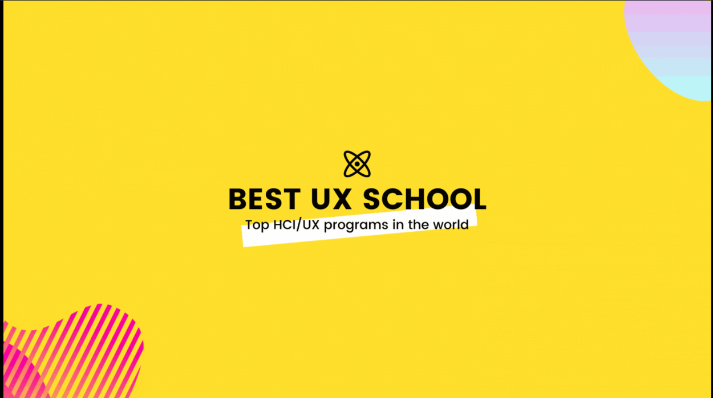

### Hi there 👋

#### I'm a Sofware Engineer working in Ahmedabad, India 🇮🇳.

##### NOW

- ✨ Working on [bestuxschool](https://www.bestuxschool) website.
- 🦉 Transitioning from Development to Design.
- 🏄 Product Enthusiast

##### BIO

- 🏢 I'm currently working at **Infostretch Corporation**
- ⚙️ I use daily: `.js`, `.jsx`, `.feature`, `.java`, `.ts`, `.txt`, `.json`
- 🌍 I'm mostly active within the **React.JS**, **Node.JS** and **Automation** communities
- 💅 Design Career: I will be joining **UMBC HCC** Program this Fall (2021).
- 🌱 Learning all about **Open Source**
- ⚡️ Fun fact: I'm not a robot.

---

#####  WHY BESTUXSCHOOL?

I have been searching for UX Schools myself for Fall 2021. I have been lucky enough to have gathered a lot of information regarding different universities. 

*But when I look around at top blogs, I realized that none of them gave a comparative picture of different universities. I mean we all struggle with the question right, "Why this university?" and that's what we are asked to write in personal statement.*

Hence I took the liberty to deep dive into their websites, look at different offerings. Ranks mentioned at different websites do matter, but to a certain limit. You have to deep dive into the research, curriculum, fees, alumni, research topics, facilities, networking opportunities, housing facilities and so much more while deciding for a university.

Use this blog as a context to that. I have extracted the information that is enough for you to atleast getting started with your search. I have created a simple path / pattern for you to surf around so that you are synced with information in similar structure.

All the information here has been taken from the official websites unless mentioned otherwise.

---

##### 📬 Get in Touch
- 
- 
- 
- 

