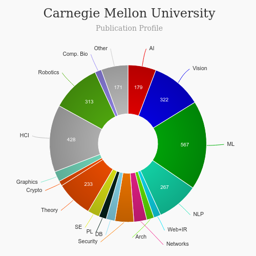

Master of Human-Computer Interaction [🔗](https://www.hcii.cmu.edu/academics/mhci)
==
<iframe width="560" height="315" src="https://www.youtube.com/embed/IoMThB-6Odc" frameborder="0" allow="accelerometer; autoplay; clipboard-write; encrypted-media; gyroscope; picture-in-picture" allowfullscreen></iframe>

# About Human-Computer Interaction (HCI) at Carnegie Mellon University

|   |   |
|---|---|
| Degree Offered |  **Master of Science** |
| Other Degrees Offered| **PHD**|
| Duration       | **1 year**                      |
| Location       | **Pittsburgh, PA**          |
| Total Credits  | **3 semester**                           | 
| Program Offered| **FALL**|
|Deadline| **January 20**  |
|Admission Type| **Regular Decision** |
|STEM| ✅ |
|Information Session Conducted| ❌ |

---

# Entry Requirements for Human-Computer Interaction (HCI) at Carnegie Mellon University 
|   |   |
|---|---|
| GRE | ✅ |
| TOEFL       | **100** (for non-native speakers)|
| Personal Statement       | ✅          |
|Personal Statement Word limit| **-** |
| Letter of Recommendation  | **3**                           | 
|Resume / CV|✅|
|Transcripts|✅ (unofficial) |
|Portfolio|💡 (optional) |
|Video Essay|✅|
|Application Fee| **$100** |

## Personal Statement Prompt for Human-Computer Interaction (HCI) at Carnegie Mellon University
* Your objective in pursuing a Master of Human-Computer Interaction, including your career goals and your reasons for applying to Carnegie Mellon's MHCI program.
* Your background in human-computer interaction or other fields relevant to your objective. Describe how your academic, industry or commercial experience prepares you for admission to the MHCI program.

---

# Cost of attendence for Human-Computer Interaction (HCI) at Carnegie Mellon University
|   |   |
|---|---|
| Cost (per semester) (in-state)      | **$25,928**          |
| Cost (per Credit) (out-of-state)      | **$25,928**      |
|Approx. Total Cost| **$77,784**|

---

# What's special about Human-Computer Interaction (HCI) at Carnegie Mellon University?

## User Studies Lab [🔗](http://coexlab.com/#facilities)
The Connected Experience lab is a research group within the Human-Computer Interaction Institute at Carnegie Mellon University addressing social, technical, and policy issues emerging around new forms of technology supported work, communication and creative collaboration. The CoEx lab is made up of postdocs, graduate and undergraduate students passionate about understanding and designing for the challenges people face working and participating in a highly connected, data-driven society."

## Design Facilities: D-Form Studio [🔗](https://www.hcii.cmu.edu/facilities)
The HCII's revolutionary D-Form Studio design space came online in January, 2013. This space, on South Craig Street adjacent to the MHCI space, contains a large studio classroom, exhibition space, a prototyping lab, and an instrumented home lab. The classroom revolutionizes how we teach design courses by allowing lecture or critique to occur in small sections or a large, contiguous space. The exhibition space hosts demonstrations, shows, workshops, and social gatherings. The prototyping lab is available for cutting, sanding, and assembling paper and wood, and for designing and creating 3D printed pieces. The instrumented home lab allows users to prototype and study how people and technology exist in domestic spaces.

## DevLab Physical Prototyping Laboratory
The DevLab provides facilities and equipment supporting rapid prototyping of interactive devices and systems. It serves as a departmental resource for faculty, students, and staff interested in building physical prototypes, small custom electronic components, and other devices and systems for advanced interactive concepts.  The laboratory provides tools such as 3D printers and laser cutters, fabrication space, and materials to facilitate construction of small-scale prototypes.

## Pittsburgh Science of Learning Center[🔗](https://learnlab.org/)
The Pittsburgh Science of Learning Center is a National Science Foundation Center housed jointly at Carnegie Mellon University and the University of Pittsburgh. This center provides a national resource called LearnLab courses for researchers to investigate mathematics, science and language arts. As part of the Pittsburgh Science of Learning Center (PSLC), the current project has access to the LearnLab, an international resource that provides a number of assets for learning scientists (PSLC, 2005).

---

# Human-Computer Interaction (HCI) at Carnegie Mellon University Course Ranking 
|||
|---|---|---|
| Top 50 Best Value UX Design Graduate Programs  | **#2**  |valuecolleges.com | 
| Top UX School      | **#1**      | topuxschool.com|
|Top UX Graduate Degree Programs| **#2**| usertesting.com|

---

# Faculty at Human-Computer Interaction (HCI) at Carnegie Mellon University [🔗](https://www.hcii.cmu.edu/people/faculty) 
Faculty in the department of HCI at the university collaborate throughout the university and beyond on their research.

Visit [CSRankings](http://csrankings.org/#/index?all&us) for more stats 

---

# Research Areas at Human-Computer Interaction (HCI) at Carnegie Mellon University [🔗](https://www.hcii.cmu.edu/research/faculty/grid)
* Social Cybersecurity [🔗](https://www.hcii.cmu.edu/research/social-cybersecurity)
* Increasing Design Innovation [🔗](https://www.hcii.cmu.edu/research/increasing-design-innovation)
* IoT Coffee Table [🔗](https://www.hcii.cmu.edu/research/iot-coffee-table)
* Understanding Mental Health with Mobile Sensing [🔗](https://www.hcii.cmu.edu/research/understanding-mental-health-mobile-sensing)

and many more...

---

# Careers at Human-Computer Interaction (HCI) at Carnegie Mellon University [🔗](https://www.cmu.edu/career/employers/index.html)
Carnegie Mellon University (CMU) is recognized as one of the top universities in the country. Our bright and talented students truly comprehend the connection between academics and work.  Our alumni are consistently recognized as leaders in their fields.  It’s no surprise Carnegie Mellon was ranked by top corporate recruiters as the #1 private university for recruiting according to a recent Wall Street Journal survey.  

---

# Social Handles of Human-Computer Interaction (HCI) at Carnegie Mellon University

* 🐦  [CMU HCI on Twitter ](https://twitter.com/cmuhcii)  
* 💢  [CMU HCI on Instagram ](https://www.instagram.com/cmuhcii) 
* 🛑  [CMU HCI on Youtube](https://www.youtube.com/channel/UC4-yjDHMlMGDEQQQ4WlbQaw)
* 🌀  [CMU HCI News](https://www.hcii.cmu.edu/news)

