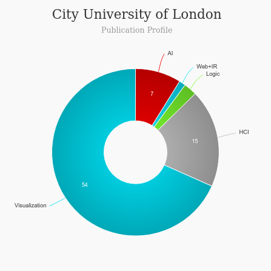

# MSc Human-Computer Interaction Design MSc [read more](https://www.city.ac.uk/study/courses/postgraduate/human-computer-interaction-design)
<iframe width="560" height="315" src="https://www.youtube.com/embed/Mv_4S8C-KyI" frameborder="0" allow="accelerometer; autoplay; clipboard-write; encrypted-media; gyroscope; picture-in-picture" allowfullscreen></iframe>

## About MSc Human Computer Interaction Design - City University
|   |   |
|---|---|
| Degree Offered |  **Master of Science (MSc)** |
| Other Degrees Offered| **-**|
| Duration       | **1 year**(full-time), **2 year**(part-time)                      |
| Location       | **Northampton Square**          |
| Total Credits  | **150**                           | 
| Program Offered| **September 2021**|
|Deadline| **-**  |
|Admission Type| **Rolling Decision** |
|Information Session Conducted| ✅ [click here to register](https://www.city.ac.uk/study/visit-us/online-events) |

---

## Entry Requirements for MSc Human Computer Interaction Design - City University [read more](https://www.ucl.ac.uk/pals/study/masters/msc-human-computer-interaction)
---
|   |   |
|---|---|
| GRE | ❌ |
| TOEFL       | **100 (minimum of 21 in Listening, 23 in Reading, 22 in Speaking and 24 in Writing)** (for non-native speakers)|
|IELTS|**7.0 (minimum of 6.5 in all four components)**(for non-native speakers)||
| Personal Statement       | ✅          |
|Personal Statement Word limit| **-** |
| Letter of Recommendation** | **-**                           | 
|Resume / CV|✅|
|Transcripts|✅ (unofficial) |
|Portfolio|💡 (optional) |
|Application Fee| **0 (no-fee)** |

** Academic references are not required when you submit your application. However, the admissions tutor may request them at a later date to help make a decision on your application.

#### Personal Statement Prompt
Read [here](https://www.city.ac.uk/__data/assets/pdf_file/0005/226751/personal-statements-for-postgraduate-study.pdf)

---

## Cost of attendence at MSc Human Computer Interaction Design - City University [read more](https://www.city.ac.uk/study/courses/postgraduate/human-computer-interaction-design#during-your-course)
|   |   |
|---|---|
| UK      | **£10,200** (FT) **£5,100** (PT)          |
| Overseas      | **£20,400** (FT) **£10,200** (PT)      |

---

## What will you learn during MSc Human Computer Interaction Design - City University?
You will study seven core modules and one elective module that cover the entire user-centred design and evaluation process. Modules are delivered through a combination of lectures, online activities and interactive workshops and tutorials. These include sessions delivered by guest lecturers from industry.

If we have insufficient number of students interested in an elective module, this may not be offered. In rare cases, one or two elective modules may not run due to low interest or unanticipated changes in timetabling, including scheduling clashes, room and staff availability. If an elective module will not run, we will advise you at the beginning of every academic term or as soon as possible, and help you choose an alternative module.

Full-time students spend eight hours per week in lectures and four hours per week in seminars and tutorials. Part-time students spend half this time in classes.

Overall workload is around 36 hours per week for full-time and 18 hours per week for part-time students.

You will also undertake an independent Research Project, for which our module on Research Methods and Professional Issues will prepare you.

A series of optional, but recommended, practitioner tutorials supplement the taught modules. These include talks, workshops and field trips. Previous tutorials have featured HCI/UX practitioners from prestigious companies, such as Foolproof, Futureheads and eBay.

### Core Modules
* Interaction Design (15 credits)
* Creativity in Design (15 credits)
* Information Architecture (15 credits)
* Evaluating Interactive Systems (15 credits)
* Inclusive Design (15 credits)
* Understanding User Interactions (15 credits)
* Research Methods and Professional Issues (15 credits)

---

## What's special about MSc Human Computer Interaction Design - City University?

### Academic facilities
You will benefit from the use of the City Interaction Lab - a combined commercial and research lab, where we have undertaken UX consultancy for prestigious companies including Virgin Atlantic. The lab is fitted with the latest technologies including: A usability testing suite, Mobile testing station, Eye-tracker, Interactive table-top, Brain interaction technology, 3D-printer and more.

### The Centre for Human-Computer Interaction Design City, University of London [read more](https://hcid.city/)

The Centre for HCI Design is one of the longest serving Human-Computer Interaction groups in London and the UK, formed over 25 years ago. We take great pride in our outstanding research, teaching, and consultancy & business services. Our prime focus is the relationship between people and innovative technology with the aim of creating more useful and usable systems.

---

## Faculty at MSc Human Computer Interaction Design - City University [read more](https://www.city.ac.uk/people/academics?school=%22School%20of%20Mathematics%2C%20Computer%20Science%20and%20Engineering%22)
Our academics are regularly sought by journalists to provide advice and comment on breaking news.

Visit [CSRankings](http://csrankings.org/#/index?all&uk) for more stats 

---

## Research Areas for MSc Human Computer Interaction Design - City University
* The study of *individual and social issues* arising from and surrounding the proliferation of information and communication technologies.
* The development of *design methods* that enable us to engage with people and communities and explore new technological possibilities.
* The prototyping of *interactive systems* that use existing and novel technologies in response to real-world needs.

and many [more](https://hcid.city/centre/research)

---

## Careers at MSc Human Computer Interaction Design - City University  [read more](https://www.ucl.ac.uk/pals/study/masters/msc-human-computer-interaction) 
*96.1% of graduates in employment or further study six months after completing the course*

This course enables you to make informed decisions on how to apply your knowledge in original and creative ways. As a result, this course empowers you to succeed in a variety of User Experience (UX) roles in leading digital agencies, business consultancies, IT companies and commercial/government organisations.

[Find out more about the Graduate Outcomes survey 2019/20.](https://www.city.ac.uk/careers/your-career/destinations-of-city-graduates?course=MSc_Human-Computer_Interaction_Design)

#### Roles include

* UX Designer/Consultant
* User Researcher
* Information Architect
* Accessibility Specialist.

---

## Social Handles of MSc Human Computer Interaction Design - City University

* 🐦  [HCID City on Twitter ](https://twitter.com/cityuni_hcid?)  
* 💢  [City on Instagram ](https://www.instagram.com/cityuniversitylondon) 
* 🛑  [City on Youtube](https://www.youtube.com/channel/UCdcOr9UlR_vZglIFntHnVnQ)
* 🌀  [UCL News](https://www.city.ac.uk/news)

---

## Housing (off-campus & on-campus) links for City University
* [Postgraduate halls](https://www.city.ac.uk/study/living-in-london/accommodation/private-accommodation)
* [Private accommodation](https://www.city.ac.uk/study/living-in-london/accommodation/private-accommodation)

