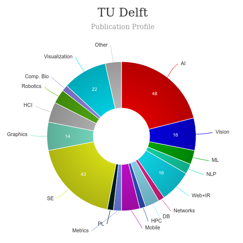

#  MSc Design for Interaction  [🔗](https://www.tudelft.nl/en/education/programmes/masters/design-for-interaction/msc-design-for-interaction/)
<iframe width="560" height="315" src="https://www.youtube.com/embed/Q72gBQG4KdQ" frameborder="0" allow="accelerometer; autoplay; clipboard-write; encrypted-media; gyroscope; picture-in-picture" allowfullscreen></iframe>

### About
---
|   |   |
|---|---|
| Degree Offered |  **Master of Science** |
| Other Degrees Offered| **-**|
| Duration       | **2 year**                      |
| Location       | **The Netherlands**          |
| Total Credits  | **120 ECTS**                           | 
| Program Offered| **FALL**|
|Deadline| **January 15**  |
|Admission Type| **Regular Decision** |
|STEM| ✅ |
|Information Session Conducted| ❌  |

### Entry Requirements
---
|   |   |
|---|---|
| GRE | ❌ |
| TOEFL**       | **100** (for non-native speakers) (Click [here](https://www.tudelft.nl/en/education/programmes/masters/science-education-and-communication/msc-science-education-and-communication/science-communication-track/admission-and-application/international-students/) to learn more)|
| Personal Statement       | ✅          |
|Personal Statement Word limit| **1,000 – 1,500 words** |
| Letter of Recommendation  | **2**                           | 
|Resume / CV|✅|
|Transcripts|✅ (unofficial) |
|Portfolio|✅ Click [here](https://www.tudelft.nl/en/education/programmes/masters/design-for-interaction/msc-design-for-interaction/admission-and-application/non-dutch-bsc-degree) to know more|
|Application Fee| **€ 100** |

**English proficiency can be shown in many ways, click [here](https://www.tudelft.nl/en/education/admission-and-application/msc-international-diploma/required-documents) for more information

#### Personal Statement Prompt
* Your motivation for choosing this MSc programme.
* Why you are interested in TU Delft and what you expect to find here.
* If this MSc programme has specialisation(s), which specialisation interests you the most and why?
* Describe your hypothetical thesis project: what kind of project would you prefer? What would you want to explore? Please limit your answer to three possible topics.
* Summarize in a maximum of 250 words your BSc thesis work or final assignment/project. Please include information about the workload.

### Cost
---
|   |   |
|---|---|
| Cost (per year) (EU/Dutch)      | **-**          |
| Cost (per year) (NON EU)      | **€ 18.750**      |
|Approx. Total Cost| **€37,500**(non EU)|
---

### Subjects

## What's special?

* **Specialisation Medisign** [🔗](https://www.tudelft.nl/en/onderwijs/opleidingen/masters/dfi/msc-design-for-interaction/programme/specialisation-medisign)
> A specialisation allows the student to gain extra in-depth knowledge on and skills in a specific topic through dedicated projects and courses within the MSc curriculum. The Medisign specialisation is aimed at students who wish to design products for health care applications. Medisign focuses on medical-technological projects in a professional setting, including designs for diagnosis, treatment, surgery, and institutional or home care. Medisign projects have applications in medications, preventive medicine and products for disabled people. The objective is to train individuals to balance industrial design and health care perspectives as they design solutions for the health care industry.

* **Programme (Curriculum)** [🔗](https://www.tudelft.nl/en/education/programmes/masters/design-for-interaction/msc-design-for-interaction/programme)
> The second year starts with a semester with an individual focus. Students can shape this semester to meet their professional ambitions. Examples of opportunities are to do a multidisciplinary design project, elective courses, a (research) internship, or a study abroad. The second year ends with establishing, defining and completing the individual graduation project.

* **Honours Programme Master** [🔗](https://www.tudelft.nl/en/education/programmes/honours-programme-delft/honours-programme-master)
> The faculty offers excellent students who have finished their Bachelor programme with an average mark of 7.5 or higher, and/or nominal running students who have shown an excellent performance during their first master’s semester, the opportunity to follow an Honours Programme in addition to the regular Master programme. Altogether, IDE’s Honours Programme Master comprises a study load of 21 EC, to be completed in parallel to the regular Master programme and within the regular programme’s time.

* **Entrepreneurship Annotation** [🔗](https://www.tudelft.nl/en/tpm/about-the-faculty/departments/staff-departments/delft-centre-for-entrepreneurship)
> The annotation Entrepreneurship trains students to become entrepreneurial, through a combination of entrepreneurship courses and a graduation project that partly focuses on entrepreneurship. The annotation is offered by the Delft Centre of Entrepreneurship (DCE).

* **Sustainable Development Annotation** [🔗](https://www.tudelft.nl/en/tpm/about-the-faculty/departments/values-technology-and-innovation/sections/economics-of-technology-and-innovation/education/annotation-tido/electives-tisd)
> The annotation Technology in Sustainable Development (TiSD) is open to all TU Delft master students (except IE and SET), who intend to integrate sustainable development into their graduation project. This annotation covers both broader and deeper knowledge regarding Sustainable Development and technology.

### Course Ranking

---
|||
|---|---|---|
| QS Global World University Rankings 2021  | **#57**  |- | 

---

### Scholorships
Click [here](https://www.tudelft.nl/en/education/practical-matters/scholarships) to learn more

### Faculty [🔗](https://www.tudelft.nl/en/ide) 
Faculty of Industrial Design Engineering

#### ** Visit [CSRankings](http://csrankings.org/#/index?all&us) for more stats 

---
### Research Areas
* Research Labs [🔗](https://www.tudelft.nl/en/ide/research/research-labs)

* Research for our Future [🔗](https://d2k0ddhflgrk1i.cloudfront.net/IO/Onderzoek/IDE_Research_Assessment_2007-2012.pdf)
> IN 2014, AN INTERNATIONAL COMMITTEE CONDUC-TED THE ASSESSMENT OF OUR RESEARCH IN THE PERIOD 2007-2012. THE COMMITTEE CONCLUDED THAT THE FACULTY TAKES A UNIQUE LEADING POSITION IN THE WORLD. IN THIS LEAFLET WE HIGH-LIGHT SOME OF THE IMPORTANT DEVELOPMENTS IN DESIGN RESEARCH AT IDE, AND ILLUSTRATE IT WITH QUOTES FROM THE COMMITTEE’S FINDINGS.

### Careers [🔗](https://www.hcde.washington.edu/future/careers)
> Graduates of the programme have been hired in recent years by companies such as Philips, Vodafone, HP, Microsoft, TomTom, Océ, and many smaller firms, and by design and market research agencies. 

---
## Social Handles of the program

* 🐦  [IDE on Twitter ](https://twitter.com/idetudelft?lang=en)  
* 💢  [IDE on Instagram ](https://www.instagram.com/idetudelft/?hl=en) 
* 🛑  [IDE on Youtube](https://www.youtube.com/user/IDETUDelft)
* 🌀  [TuDelft News](https://www.tudelft.nl/en/ide/news/archive/)

---
## Housing (off-campus & on-campus) links
* [TuDelft Student Housing](https://www.tudelft.nl/en/student/faculties/tpm-student-portal/education/study-abroad/housing/)
* [Find room / roommate in Delft](https://www.facebook.com/groups/roomandroommateindelft/)
* [International Student Housing Delft](https://www.facebook.com/internationalstudenthousingdelft/)