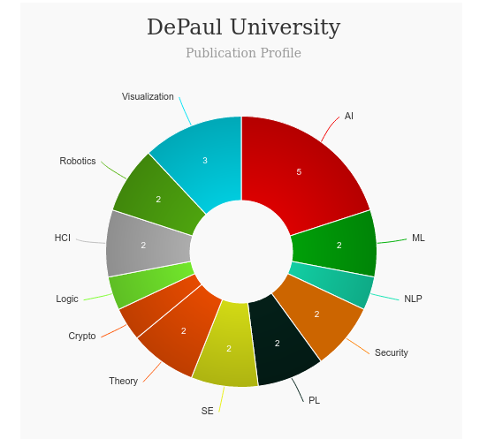

* [M.S in Human Computer Interaction](#hci)
* [MA in Experience Design](#exdesign)

<iframe width="560" height="315" src="https://www.youtube.com/embed/Q2HpJUBNHFM" frameborder="0" allow="accelerometer; autoplay; clipboard-write; encrypted-media; gyroscope; picture-in-picture" allowfullscreen></iframe>

# Master of Science in Human Computer Interaction [🔗](https://www.cdm.depaul.edu/academics/Pages/MS-In-Human-Computer-Interaction.aspx)

# About Human Computer Interaction (HCI) at DePaul University

|   |   |
|---|---|
| Degree Offered |  **Master of Science** |
| Other Degrees Offered| **Bachelor of Science in UX Design**|
| Duration       | **2-2.5 year**                      |
| Location       | **Chicago, Illinois OR [Online](https://www.cdm.depaul.edu/onlinelearning/Pages/default.aspx)**          |
| Total Credits  | **52**                           | 
| Program Offered| **FALL, WINTER, SPRING, SUMMER**|
|Deadline| **Fall - June 15, Winter - October 15, Spring - January 15, Summer - April 15**  |
|Offer Made| **-**|
|Admission Type| **Rolling Based Decision** |
|STEM| ✅ |
|Information Session Conducted| ✅ [click here to register](https://grad.depaul.edu/portal/cdm-information-session) |

---

# Entry Requirements for Human Computer Interaction (HCI) at DePaul University
---
|   |   |
|---|---|
| GRE | ❌ |
| TOEFL**       | **80** (for non-native speakers)|
| Personal Statement       | 💡(optional)          |
|Personal Statement Word limit| **-** |
| Letter of Recommendation  | 💡(optional)                           | 
|Resume / CV|✅|
|Transcripts|✅ ([Transcript evaluation](https://www.cdm.depaul.edu/Admission-and-Aid/Pages/TranscriptEvaluation.aspx) for international applicants) |
|Portfolio| 💡(optional) |
|Application Fee| **$25** |

**English proficiency cannot be waived for non-native speakers

## Personal Statement Prompt
Graduate schools often require a written statement—often called a “statement of purpose,” “personal statement” or “letter of intent”—as a part of the application. Some require fairly specific information. Others are unstructured, leaving the applicant free to address a wide range of topics. Usually the purpose is to persuade the admissions committee that you are a distinctive applicant who should be selected. Read the complete guide [here](https://resources.depaul.edu/career-center/resumes-interviews/Pages/personal-statements.aspx)

---

# Cost of attendence at Human Computer Interaction (HCI) at DePaul University
|   |   |
|---|---|
| Cost (per Credit) (in-state)      | **$865**          |
| Cost (per Credit) (out-of-state)      | **$865**      |
|Approx. Total Cost| **$44,980**|

---

# What's special about Human Computer Interaction (HCI) at DePaul University?

## Student Research [🔗](https://www.cdm.depaul.edu/academics/research/Pages/StudentResearch.aspx)
Undergraduate and graduate students who are looking for hands-on experience and the opportunity to collaborate with faculty in their field of study are encouraged to pursue research and creative projects at CDM.

## Professional Organizations [🔗](https://dehub.campusgroups.com/xdr/home/)
Many HCI students and alums contribute to professional organizations such as XD Roundtable and Chicago Interaction Design Association, both of which provide opportunities to network with HCI professionals. XD Roundtable, a student group at DePaul, promotes lifelong independent learning though frequent peer-to-peer workshops and challenges right on campus.

## Usability Lab [🔗](https://www.cdm.depaul.edu/Student-Resources/Pages/LabsAndResources/Lab805.aspx)
The health and safety of everyone at DePaul depends on the cooperation of all who come to campus.

## Online Learning
This degree can be completed entirely online. One hundred percent of the program’s lectures—from audio and video to whiteboard writing and supplemental materials—are captured and available online.

---

# Human Computer Interaction (HCI) at DePaul University Course Ranking
|||
|---|---|---|
| Top 50 Best Value UX Design Graduate Programs  | **#22**  |valuecolleges.com | 
| Top UX School      | **#37**      | topuxschool.com|

---

# Faculty at Human Computer Interaction (HCI) at DePaul University [🔗](https://www.cdm.depaul.edu/Faculty-and-Staff/Pages/Faculty.aspx?ftype=soc&selectedareataught=&lastnamefilter=ALL&level=-1) 

Visit [CSRankings](http://csrankings.org/#/index?all&us) for more stats 

---

# Research Areas at Human Computer Interaction (HCI) at DePaul University
- Child-Computer Interaction
-Interactive technologies/toys designed for children/students who have autism
- Mobile-based interaction design and user testing
- User Experience (UX) Professionals and Pedagogy
- Bridging the design/research dialogue gap by exploring methods UX professionals use to (a) investigate and (b) communicate about end-users.
- How accessibility is taught, practiced and considered. 
- human factors and human-computer interaction methodologies, design principles and theories to understand health care systems to promote safety and patient-centered care.

---

# Tution and Financial Aid for Human Computer Interaction (HCI) at DePaul University [🔗](https://www.cdm.depaul.edu/Admission-and-Aid/Pages/TuitionandFinancialAid.aspx)     

---

# Careers after Human Computer Interaction (HCI) at DePaul University [🔗](https://www.cdm.depaul.edu/academics/Pages/MS-In-Human-Computer-Interaction.aspx)
A graduate degree in HCI prepares students for many different kinds of careers in user experience (UX). 

## Job Titles
Graduates have job titles including interaction designer, information architect, user experience designer, usability specialist, and user researcher.

## Salary Range
* **$82,000** median salary reported by program graduates 6 months after degree completion
* **94%** of reporting program graduates were employed, continuing education, or not seeking employment within six months of graduation

---

# Social Handles of Human Computer Interaction (HCI) at DePaul University

* 🐦  [DePaul CDM on Twitter ](https://twitter.com/CDMDePaul)  
* 💢  [DePaul CDM on Instagram ](https://www.instagram.com/cdmdepaul/?hl=en) 
* 🛑  [DePaul CDM on Youtube](https://www.youtube.com/channel/UCp4E9iH12CPU2faG8a6cq3w)
* 🌀  [DePaul News](https://depauliaonline.com/)

# Master of Arts in Experience Design [🔗](https://www.cdm.depaul.edu/academics/Pages/MA-In-Experience-Design.aspx)

# About MA in Experience Design at DePaul University
---
|   |   |
|---|---|
| Degree Offered |  **Master of Arts** |
| Other Degrees Offered| -|
| Duration       | **2-2.5 years**                      |
| Location       | **Chicago, Illinois**          |
| Total Credits  | **46**                           | 
| Program Offered| **FALL, WINTER**|
|Deadline| **June 15, October 15**  |
|Offer Made| **-**|
|Admission Type| **Rolling Based Decision** |
|STEM| ✅ |
|Information Session Conducted| ✅ [click here to register](https://grad.depaul.edu/portal/cdm-all) |

# Entry Requirements for MA in Experience Design at DePaul University
---
|   |   |
|---|---|
| GRE | ❌ |
| TOEFL**       | **80** (for non-native speakers)|
| Personal Statement       | 💡(optional)          |
|Personal Statement Word limit| **-** |
| Letter of Recommendation  | 💡(optional)                           | 
|Resume / CV|✅|
|Transcripts|✅ ([Transcript evaluation](https://www.cdm.depaul.edu/Admission-and-Aid/Pages/TranscriptEvaluation.aspx) for international applicants) |
|Portfolio| 💡(optional) |
|Application Fee| **$25** |

**English proficiency cannot be waived for non-native speakers

## Personal Statement Prompt
> describe your interest in HCI and design, and explain what specific elements of the MHCI+D Program make it a good fit for you. How have your prior experiences (at school and in the workplace if applicable) prepared you for this program and this field? How will this program assist you in your longer-term goals? The personal statement is your opportunity to present your goals and experience as they relate to human-computer interaction and design. We’re interested in how you see the field and this program from your own personal perspective.

# Cost of attendence for MA in Experience Design at DePaul University
---
|   |   |
|---|---|
| Cost (per Credit) (in-state)      | **$1,098**          |
| Cost (per Credit) (out-of-state)      | **$1,098**      |
|Approx. Total Cost| **$52,704**|
---

# What's special about MA in Experience Design at DePaul University?

## Idea Realization Lab [🔗](http://irl.depaul.edu/)
Students have a wealth of resources available to them including research assistantships, independent studies, media and computer labs, and design facilities like the student-driven makerspace, the Idea Realization Lab.

## Technology for Social Good(TSG) Lab [🔗](https://tsg.cdm.depaul.edu/)
TSG is focused on designing, building, and studying tools with the goal of fostering equitable education and empowerment in urban communities.

## School of Design Talks [🔗](https://www.cdm.depaul.edu/academics/Creative%20Activity/Pages/Visiting-Designer-Series.aspx)
The School of Design Talks series invites leading designers who have created innovative responses to the personal, local, and global challenges of the 21st century. Organized by CDM’s School of Design, the series prepares students to imagine, develop, and deploy cutting-edge visual and interactive designs that positively impact individuals and communities using emerging social practices and technologies. I

# MA in Experience Design at DePaul University Course Ranking
---
|||
|---|---|---|
| Top 50 Best Value UX Design Graduate Programs  | **#17**  |valuecolleges.com | 
| Top UX School      | **#37**      | topuxschool.com|
---

# Faculty at MA in Experience Design at DePaul University [🔗](https://www.cdm.depaul.edu/Faculty-and-Staff/Pages/Faculty.aspx?ftype=sod&selectedareataught=&lastnamefilter=ALL&level=-1)
Faculty at the DePaul CDM collaborate throughout the university and beyond on their research.

---

# Careers after MA in Experience Design at DePaul University [🔗](https://www.cdm.depaul.edu/academics/Pages/MA-In-Experience-Design.aspx)
> raduates will be prepared for the many varied career options available to those skilled in experience design.

## Job Titles
Jobs in these careers include experience designers, design strategists, product designers, visual designers, game designers, educational technology designers, and exhibit designers. Students may pursue jobs across varied industries as businesses and organizations look toward design for competitive advantage and innovation.

---
# Social Handles of MA in Experience Design at DePaul University

* 🐦  [DePaul CDM on Twitter ](https://twitter.com/CDMDePaul)  
* 💢  [DePaul CDM on Instagram ](https://www.instagram.com/cdmdepaul/?hl=en) 
* 🛑  [DePaul CDM on Youtube](https://www.youtube.com/channel/UCp4E9iH12CPU2faG8a6cq3w)
* 🌀  [DePaul News](https://depauliaonline.com/)

---

# Housing (off-campus & on-campus) links for DePaul University
* [DePaul Students Living Off Campus](https://www.facebook.com/groups/353212584801276/)
* [DePaul Housing](https://www.facebook.com/DePaulHousing/)
* [DePaul Students Living Off Campus](https://www.facebook.com/groups/353212584801276//)
* [DePaul University (DEPAUL) Housing, Sublets & Roommates](https://www.facebook.com/groups/472811996208548/)