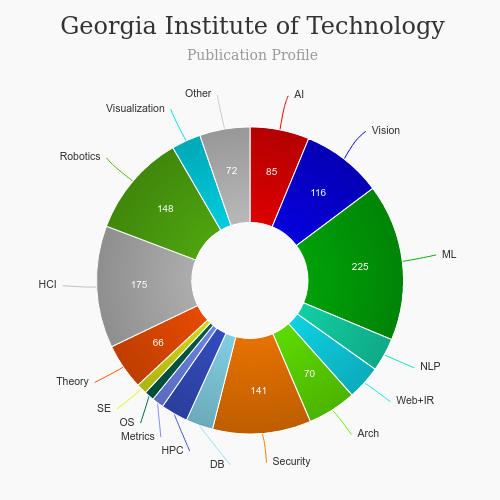

# Master of Human Computer Interaction (MS-HCI) [read more](http://mshci.gatech.edu/)
<iframe width="560" height="315" src="https://www.youtube.com/embed/6kylRHpYw6E" frameborder="0" allow="accelerometer; autoplay; clipboard-write; encrypted-media; gyroscope; picture-in-picture" allowfullscreen></iframe>

## About Georgia Tech HCI

|   |   |
|---|---|
| Degree Offered |  **Master of Science** |
| Other Degrees Offered| **-**|
| Duration       | **2 years**                      |
| Location       | **Atlanta, Ga**          |
| Total Credits  | **36**                           | 
| Program Offered| **FALL**|
|Deadline| **February 1**  |
|Offer Made| **5-6 weeks**|
|Admission Type| **Regular Decision** |
|STEM| ✅ |
|Information Session Conducted| **-** |

---

## Entry Requirements for Georgia Tech HCI
|   |   |
|---|---|
| GRE | ❌ (waived for Fall 2021)|
| TOEFL       | **100** (for non-native speakers)|
| Personal Statement       | ✅          |
|Personal Statement Word limit| **50-300 words** |
| Letter of Recommendation  | **3**                           | 
|Resume / CV|✅|
|Transcripts|✅ (unofficial) |
|Portfolio|💡 (optional) |
|Application Fee| **$75 (in-state) $85 (international)** |

### Personal Statement Prompt
Read [here](https://admission.gatech.edu/first-year/personal-essays)

---

## Cost for Georgia Tech HCI [read more](http://www.bursar.gatech.edu/content/tuition-fees)
|   |   |
|---|---|
| Cost (per Credit) (in-state)      | **-**          |
| Cost (per Credit) (out-of-state)      | **-**      |
|Approx. Total Cost| **$32,128 (in-state) && $70,816(out-state)**|
*this data is from topuxschool.com*

---

## What's special about Georgia Tech HCI?

### collaborative by four schools [read more](https://mshci.gatech.edu/program/about)
The MS in HCI is an interdisciplinary program offered collaboratively by four schools: Industrial Design, Interactive Computing, Literature, Media, and Communication (LMC), Psychology

### Interactivity@GT [read more](http://interactivity.cc.gatech.edu/)
Interactivity@GT, presented by Georgia Tech's GVU Center, is the annual showcase featuring graduate students enrolled in the Institute's M.S. in Human-Computer Interaction, M.S. in Digital Media, and Master of Industrial Design programs. 

### HCI Scene [read more](https://mshci.gatech.edu/industry/HCIscene)
Related Degree Programs: The HCI area of study is applicable to many major fields, including 13 directly related degree programs at Georgia Tech.

---

## Georgia Tech HCI Course Ranking
|||
|---|---|---|
| Top 50 Best Value UX Design Graduate Programs  | **#8**  |valuecolleges.com | 
| Top UX School      | **#6**      | topuxschool.com|
|Top UX Graduate Degree Programs| **#3**| usertesting.com|

---

## Faculty at Georgia Tech HCI [read more](https://mshci.gatech.edu/faculty) 
Our faculty are well-recognized in their fields of endeavor and include members of the CHI Academy and the National Academy of Engineering, as well as ACM, HFES, and IEEE Fellows, technical and lifetime achievement award winners, journal editors, and conference chairs.

Visit [CSRankings](http://csrankings.org/#/index?all&us) for more stats 

---

## Research Areas at Georgia Tech HCI
* GVU Labs [read more](http://gvu.gatech.edu/research/labs )
* GVU Projects [read more](http://gvu.gatech.edu/research/projects)
* HCI Research [read more](https://mshci.gatech.edu/research/centers)
* Research Centers [read more](https://mshci.gatech.edu/research/research_centers)

---

## Careers after Georgia Tech HCI  [read more](http://interactivity.cc.gatech.edu/)
Interactivity@GT, presented by Georgia Tech's GVU Center, is the annual showcase featuring graduate students enrolled in the Institute's M.S. in Human-Computer Interaction, M.S. in Digital Media, and Master of Industrial Design programs. Due to COVID-19, Interactivity@GT in 2021 will feature an on-line career fair that is focused on UX/HCI jobs and internships for students enrolled in the three programs. 

---

## Georgia Tech HCI Social Handles

* 🐦  [GA-HCI on Twitter ](https://twitter.com/gthci?lang=en)  
* 💢  [GA-HCI on Instagram ](https://www.instagram.com/georgiatechhci/) 
* 🛑  [GA-HCI on Youtube](https://www.youtube.com/channel/UC2AT69b1caaV-GSY2cVvNQA/featured)
* 🌀  [GA-HCI News](https://mshci.gatech.edu/news_events)

