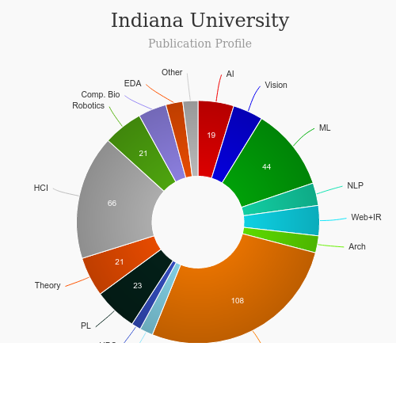

# Master of Human Computer Interaction Design (HCI/d) [read more](https://hcid.luddy.indiana.edu/)
<iframe width="560" height="315" src="https://www.youtube.com/embed/D_6EY_diCPI" frameborder="0" allow="accelerometer; autoplay; clipboard-write; encrypted-media; gyroscope; picture-in-picture" allowfullscreen></iframe>

## About Human Computer Interaction Design (HCID) - Indiana University
|   |   |
|---|---|
| Degree Offered |  **Master of Science** |
| Other Degrees Offered| **PHD**|
| Duration       | **2 years**                      |
| Location       | **Bloomington, Indiana**          |
| Total Credits  | **36**                           | 
| Program Offered| **FALL**|
|Deadline| **January 1 (priority deadline), February 1 (2nd deadline), February 26 (3rd deadline)**  |
|Admission Type| **Regular Decision** |
|STEM| ✅ |
|Information Session Conducted| ❌ |

---

## Entry Requirements for Human Computer Interaction Design (HCID) - Indiana University [read more](https://ois.iu.edu/admissions/apply/graduate/equivalent.html)
|   |   |
|---|---|
| GRE | 💡 (optional) |
| TOEFL**       | **96** (for non-native speakers)|
| Personal Statement       | ✅          |
|Personal Statement Word limit| **1-3 pages** |
| Letter of Recommendation  | **3**                           | 
|Resume / CV|✅|
|Transcripts|✅ (unofficial) |
|Portfolio|✅ |
|Application Fee| **$70** |

**English proficiency cannot be waived

### Personal Statement Prompt
* An explanation of why our program is the right fit for your academic/career goals
* Why you want to be part of the program
* A description your academic goals and your abilities
* A discussion your plans after completion of the degree
* Information on the area of research you would like to pursue

---

## Cost of attendence at Human Computer Interaction Design (HCID) - Indiana University

|   |   |
|---|---|
| Cost (per Credit) (in-state)      | **$478.82**          |
| Cost (per Credit) (out-of-state)      | **$1,491.41**      |
|Approx. Total Cost| **$17,237.52**(in-state) **$53,690**(out-state)|

---

## What's special about Human Computer Interaction Design (HCID) - Indiana University?

### Cohort Culture [read more](https://hcid.luddy.indiana.edu/)
We carefully select students from various countries, backgrounds and cultures to form a multidisciplinary cohort which goes on to become a tightly knit community of designers. 

### CULTURA [read more](https://medium.com/iuhcid)
CULTURA is a place for current and past designers in the Human-Computer Interaction Design Masters program at Indiana University Bloomington to share their thoughts

### Capstone Projects [read more](https://hcid.luddy.indiana.edu/asset/files/Capstone-Book-2020.pdf)

---

## Human Computer Interaction Design (HCID) - Indiana University Course Ranking
|||
|---|---|---|
| Top 50 Best Value UX Design Graduate Programs  | **#25**  |valuecolleges.com | 
| Top UX School      | **#15**      | topuxschool.com|

---

## Faculty at Human Computer Interaction Design (HCID) - Indiana University [read more](https://hcid.luddy.indiana.edu/faculty.html) 
Faculty in the department of HCID at the Indiana University  collaborate throughout the university and beyond on their research.

Visit [CSRankings](http://csrankings.org/#/index?all&us) for more stats 

---

## Research Areas at Human Computer Interaction Design (HCID) - Indiana University  [read more](https://informatics.indiana.edu/research/index.html)
* Center for complex Network and System research [read more](https://cnets.indiana.edu/)
* Computing Culture and Society [read more](https://ccs.luddy.indiana.edu/)
* Human Computer Interaction Design [read more](https://hcid.luddy.indiana.edu/)
* Proactive Health Lab [read more](https://prohealth.luddy.indiana.edu/)
* R-House [read more](https://r-house.luddy.indiana.edu/)
* Security & Privacy in Informatics, Computing and Engineering [read more](https://spice.luddy.indiana.edu/)

---

## Careers after Human Computer Interaction Design (HCID) - Indiana University [read more](https://hcidconnect.sice.indiana.edu/)

### Job Titles
Our students are endowed with design thinking skills as a natural outcome of a strong cohort and critical thinking skills. As a result, they go to become design leaders, research leads, product leaders and hold high level strategy positions. 

---

## Social Handles of Indiana University

* 🐦  [IU on Twitter](https://twitter.com/iubloomington)  
* 💢  [IU on Instagram ](https://www.instagram.com/iubloomington/?hl=en) 
* 🛑  [IU on Youtube](https://www.youtube.com/channel/UC8LGC2hm9zF8uKDZfZzQysA)
* 🌀  [IU News](https://news.iu.edu/)

