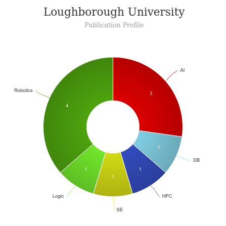

# User Experience Design MSc [🔗](https://www.lboro.ac.uk/study/postgraduate/masters-degrees/a-z/user-experience-design-msc/)
<iframe width="560" height="315" src="https://www.youtube.com/embed/xRuPfwhjJhE" frameborder="0" allow="accelerometer; autoplay; clipboard-write; encrypted-media; gyroscope; picture-in-picture" allowfullscreen></iframe>

# About User Experience Design MSc - Loughborough University
---
|   |   |
|---|---|
| Degree Offered |  **Master of Science (MSc)** |
| Other Degrees Offered| **-**|
| Duration       | **1 year**(full-time), **Not Available**(part-time)                      |
| Location       | **[loughborough](https://www.lboro.ac.uk/study/postgraduate/locations/loughborough/)**          |
| Program Offered| **October 2021**|
|Application Deadline| **6 September**|
|Admission Type| **Rolling Decision** |
|Information Session Conducted| ✅ [click here to register](https://www.lboro.ac.uk/study/postgraduate/email-updates/) |

# Entry Requirements for User Experience Design MSc - Loughborough University [🔗](https://www.ucl.ac.uk/pals/study/masters/msc-human-computer-interaction)
---
|   |   |
|---|---|
| GRE | ❌ |
| TOEFL       | **Overall score of 92, with not less than 22 in each test** (for non-native speakers)|
|IELTS|**Overall score of 6.5 with not less than 6.0 in each test**(for non-native speakers)||
| Personal Statement       | ✅          |
|Total Credits|**180** |
|Personal Statement Word limit| **-** |
| Letter of Recommendation  | **2**                           | 
|Resume / CV|✅|
|Transcripts|✅ (unofficial) |
|Portfolio ***|💡 (optional) |
|Application Fee| **£18** |

** English proficiency can be proved in many other ways. Read [here](https://www.lboro.ac.uk/international/apply/english-language-requirements/)

*** All students, of any nationality, who are from a design-related background should provide a portfolio showing examples of work relevant to the MSc User Experience Design. This should be around 10 pages long. You must demonstrate your understanding of human centred design, including your design process, the project outcome, and how you considered the end user’s experience. We encourage you to critically reflect on how you could improve your technique and project outcomes.

## Personal Statement Prompt
> this should explain your motivation for studying the programme, any relevant skills and experience you have (through studying or work), and your future career aspirations and how this programme will support you in achieving this. Remember to let your passion for the subject shine through!

# Cost of attendence at User Experience Design MSc - Loughborough University
---
|   |   |
|---|---|
| UK      | **£11,400**          |
| Overseas      | **£25,450**     |
---

# Scholorships available for User Experience Design MSc - Loughborough University
> There are a number of different funding options available to master's students, including scholarships, bursaries and loans. For more information, please see our [master's degree funding page.](https://www.lboro.ac.uk/study/postgraduate/fees-funding/masters-funding/)

## What will you study?

Why you should study this degree

* Develop empathic digital products and services based on **design-thinking models** and negotiation of conflicting user perspectives; realised through Experience Design.
* Appraise user-centred design’s fundamental **research techniques** to investigate emotional and cognitive experiences; realised through Design Research Methods.
* Synthesise **usability evaluation, website design, and psychology** to make informed judgements on iterative website design; realised through Usability Principles and Practice.
* Support the student’s creative, analytical, or technological skills growth within design or creative arts contexts; realised through the Optional modules.
* Construct **sophisticated Human-Machine prototypes** with the aid of statistics, advanced usability principles, data analytics and experimental prototyping techniques; realised through UX Design for Advanced Technology.
*  **Design innovative solutions to society’s complex problems** while collaborating with other design specialities; realised through the Industry Project.
* Develop original research into unsolved and novel **User Experience and Human-Computer Interaction problems**; realised through user-centred experimentation via the new **UX Design Research** module.

# Faculty at User Experience Design MSc - Loughborough University [🔗](https://www.lboro.ac.uk/departments/design-school/staff/)
Cees de Bont is the Dean of Loughborough Design School.

## ** Visit [CSRankings](http://csrankings.org/#/index?all&uk) for more stats 

---

## Research Areas at User Experience Design MSc - Loughborough University [🔗](https://www.lboro.ac.uk/research/)

---

# Careers After User Experience Design MSc - Loughborough University
>   Organisations beyond the design industry - including management and information technology companies - value the user-centred design skills we teach. Graduates usually pursue careers as user experience designers, interaction designers, user researchers, usability specialists, and consultants. In some cases, graduates go on to careers in research, teaching, or progress onto PhD study..

## Graduate destinations

Employment destinations of our recent graduates include **IBM Design, IBM iX, Samsung, Next, Dyson, Tencent, Huawei, Baidu, and Pivotal Labs.**

The MSc in User Experience Design is offered alongside a parallel MA in User Experience and Service Design programme. The key difference is that the MSc is more focused on empirical investigation, data analysis and technologies that can create great user experiences. In contrast, the MA has a more empathic and broader world-view of user experience design.

---
# Social Handles of the program

* 🐦  [Lborouniversity on Twitter](https://twitter.com/lborouniversity)  
* 💢  [Lborouniversity on Instagram ](https://www.instagram.com/lborouniversity/) 
* 🛑  [Lborouniversity on Youtube](https://www.youtube.com/user/lborouniversity)
* 🌀  [Lborouniversity News](https://www.lboro.ac.uk/news-events/)

---
