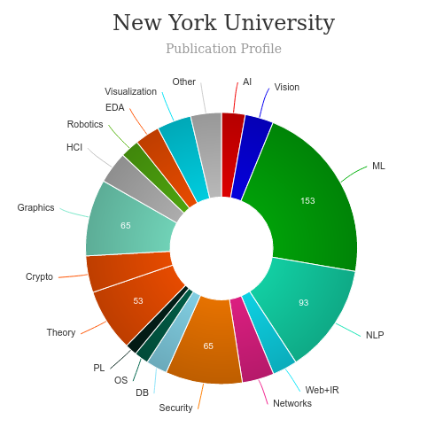

# ITP MPS Graduate Program [🔗](https://tisch.nyu.edu/itp/admissions/itp-mps)

### About
---
|   |   |
|---|---|
| Degree Offered |  **Master of Professional Studies (MPS)** |
| Other Degrees Offered| **-**|
| Duration       | **2 year**                      |
| Location       | **New York, NY**          |
| Total Credits  | **60**                           | 
| Program Offered| **FALL**|
|Deadline| **January 5**  |
|Admission Type| **Regular Decision** |
|STEM| ✅ |
|Information Session Conducted| ✅ [click here to register](https://tisch.nyu.edu/itp/events/fall-2019/itp-resource-information-session) |

### Entry Requirements
---
|   |   |
|---|---|
| GRE | ❌ |
| TOEFL      | **100 (preferred) No Min)** (for non-native speakers)|
| Personal Statement       | ✅          |
|Personal Statement Word limit| **1000 words** |
| Letter of Recommendation  | **2**                           | 
|Resume / CV|✅|
|Transcripts|✅ (unofficial) |
|Portfolio|💡 (optional) |
|Video Essay|✅|
|Application Fee| **$80** |

#### Personal Statement Prompt
> We ask for a personal statement because we want to get a sense of who you are in your own words beyond what we can infer from your resume/CV. We want to see how your experiences, successes, and failures have shaped how you see the world, what ideas you have and what you want to do. Name an issue or two, big or small, in the world that is important to you. In what way could you address this problem or create awareness about it?  If you could revisit a previous project of yours again, how would you do it differently? You can write about anything that shows us what ideas you have and what you want to do. Don't be afraid to take some chances. Please note that you do not need to address all of the prompts above.

### Cost
---
|   |   |
|---|---|
| Cost (per 12 or 18 Credit) (in-state)      | **$31,598**          |
| Cost (per Credit) (out-of-state)      | **$31,598**      |
|Approx. Total Cost| **$1,31,852**|
---

### Subjects

## What's special?

* **ITP Graduate Courses** [🔗](https://tisch.nyu.edu/itp/courses/itp-courses)

* **Diversity, Equity & Inclusion** [🔗](https://tisch.nyu.edu/diversity.html)
> While we have always strived for a community upheld by these values, recent conversations with a dedicated group of students, faculty, staff, alumni, and school leaders prove that we have a long way to go. We must do more than witness and stand in solidarity. We must commit to honest and difficult conversations about the structures and practices in our school that support and sustain inequities, and collectively work to dismantle racism by aligning our practices and resources to the values we celebrate: equity and racial justice.

### Course Ranking
---
|||
|---|---|---|
| Top 50 Best Value UX Design Graduate Programs  | **#43**  |valuecolleges.com | 
| Top UX School      | **#10**      | topuxschool.com|
---

### Faculty [🔗](https://tisch.nyu.edu/itp/itp-people/faculty) 
ITP has over 100 adjunct professors who teach at ITP on a rotating basis. You can find bios at the ITP People Directory.

#### ** Visit [CSRankings](http://csrankings.org/#/index?all&us) for more stats 

---
### Research Areas
Learn about everything they do [here](https://itp.nyu.edu/ranch/projects/) 

### Careers [🔗](https://itp.nyu.edu/ima/curriculum/life-after-ima/)
> Graduates from the University of Washington's department of Human Centered Design & Engineering find careers as designers and researchers who improve people's interactions with technology and the world around them.

#### Job Titles
* See the interactive chart [here](https://itp.nyu.edu/registration/alum/beta.php)
* You can also find some information via there alumni page [here](https://tisch.nyu.edu/itp/itp-people/alumni)

---
## Social Handles of the program

* 🐦  [NYUTisch School on Twitter ](https://twitter.com/nyutischschool/)  
* 💢  [NYUTisch School on Instagram ](https://www.instagram.com/nyutisch) 
* 🌀  [NYUTisch School News](https://tisch.nyu.edu/itp/news)

---

# Master of Human-Computer Interaction and Design (MHCI+D)  [🔗](https://mhcid.washington.edu/)
<iframe width="560" height="315" src="https://www.youtube.com/embed/xeKw6LpDeTQ" frameborder="0" allow="accelerometer; autoplay; clipboard-write; encrypted-media; gyroscope; picture-in-picture" allowfullscreen></iframe>

### About
---
|   |   |
|---|---|
| Degree Offered |  **Master of Science** |
| Other Degrees Offered| -|
| Duration       | **11 months**                      |
| Location       | **Seattle, Washington**          |
| Total Credits  | **46**                           | 
| Program Offered| **FALL**|
|Deadline| **January 15**  |
|Offer Made| **March 15**|
|Admission Type| **Regular Decision** |
|STEM| ✅ |
|Information Session Conducted| ✅ [click here to register](https://mhcid.washington.edu/how-to-learn-more/) |

### Entry Requirements
---
|   |   |
|---|---|
| GRE | ❌ |
| TOEFL**       | **106** (for non-native speakers)|
| Personal Statement       | ✅          |
|Personal Statement Word limit| **500-800 words** |
| Letter of Recommendation  | **3**                           | 
|Resume / CV|✅|
|Transcripts|✅ (unofficial) |
|Portfolio|💡 (optional) |
|Application Fee| **$85** |

**English proficiency can be shown in many ways, click [here](https://grad.uw.edu/policies-procedures/graduate-school-memoranda/memo-8-graduate-school-english-language-proficiency-requirements/) for more information

#### Personal Statement Prompt
> describe your interest in HCI and design, and explain what specific elements of the MHCI+D Program make it a good fit for you. How have your prior experiences (at school and in the workplace if applicable) prepared you for this program and this field? How will this program assist you in your longer-term goals? The personal statement is your opportunity to present your goals and experience as they relate to human-computer interaction and design. We’re interested in how you see the field and this program from your own personal perspective.

### Cost
---
|   |   |
|---|---|
| Cost (per Credit) (in-state)      | **$1,098**          |
| Cost (per Credit) (out-of-state)      | **$1,098**      |
|Approx. Total Cost| **$52,704**|
---

### Subjects

## What's special?

* **Capstone Projects** [🔗](https://mhcid.washington.edu/capstone-projects/)
> Capstone projects are focused on solving current problems in professional practice and may address domains such as health & wellbeing, the environment, education, assistive technology, retail, or travel. Student teams work with mentorship from industry advisors to apply iterative research, design, prototyping, and evaluation methods to produce a comprehensive solution or product design, and portfolio presentation.

* **Career Conference** [🔗](https://mhcid.washington.edu/career/)
> MHCI+D’s annual Career Conference is a fantastic opportunity for industry and students to interact one-on-one and get to know each other. It’s not about who has jobs, it’s about building relationships with our graduates and they with you.

* **The Curriculum** [🔗](https://mhcid.washington.edu/curriculum/)
> Learn about core and elective classes that create the MHCI+D experience

### Course Ranking
---
|||
|---|---|---|
| Top 50 Best Value UX Design Graduate Programs  | **#17**  |valuecolleges.com | 
| Top UX School      | **#3**      | topuxschool.com|
---

### Faculty [🔗](https://mhcid.washington.edu/faculty/)
Faculty in the department of Human Centered Design & Engineering at the University of Washington in Seattle collaborate throughout the university and beyond on their research.

#### ** Visit [CSRankings](http://csrankings.org/#/index?all&us) for more stats 

---

### Careers [🔗](https://mhcid.washington.edu/career-services/)
> As a student in the MHCI+D Program, your main focus is on coursework and learning as much as possible in the one year you are here. Building your skills and knowledge during the program is the single most important means of preparing for your career.

#### Job Titles
||||
|---|---|---|
|UX Designer 	|34%| 	62|
|Product Designer |	21% 	|39|
|Interaction Designer |	13% |	24|
|User Researcher 	|11% |	20|
|Design Technologist |	4% |	7|
|Other| 	16% |	30|

---
## Social Handles of the program

* 🐦  [MHCID on Twitter ](https://twitter.com/uwmhcid)  
* 💢  [MHCID on Instagram ](https://www.instagram.com/uwmhcid/) 
* 🛑  [MHCID on Youtube](https://www.youtube.com/user/UWMHCID)
* 🌀  [MHCID Homepage](https://mhcid.washington.edu/)

---

## Housing (off-campus & on-campus) links
* [UW Student Housing](https://www.washington.edu/about/housing/)
* [University of Washington (UW) Housing, Sublets & Roommates](https://www.facebook.com/groups/445293202296621/)
* [University of Washington Housing, Rooms, Apartments, Sublets](https://www.facebook.com/groups/2010322712550585/)
