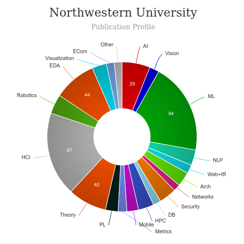

# Master of Science in Engineering Design Innovation (EDI) [🔗](https://design.northwestern.edu/engineering-design-innovation/)
<iframe width="560" height="315" src="https://www.youtube.com/embed/dzXMvcBBcho" frameborder="0" allow="accelerometer; autoplay; clipboard-write; encrypted-media; gyroscope; picture-in-picture" allowfullscreen></iframe>

# About MSc in Engineering Design Innovation (EDI) - Northwestern University
---
|   |   |
|---|---|
| Degree Offered |  **Master of Science** |
| Other Degrees Offered| **-**|
| Duration       | **18 month**                      |
| Location       | **Evanston, Illinois**          |
| Total Credits  | **4 quarters**                           | 
| Program Offered| **FALL**|
|Deadline| **January 15**  |
|Offer Made| **March 15**|
|Admission Type| **Regular Decision (rolling based after deadline is passed)** |
|STEM| ✅ |
|Information Session Conducted| ✅ [click here to register](https://digitallearning.northwestern.edu/events/edi-online-information-session-0) |

# Entry Requirements for MSc in Engineering Design Innovation (EDI) - Northwestern University
---
|   |   |
|---|---|
| GRE | ❌ (waived for Fall 2021) |
| TOEFL**       | **95** (for non-native speakers)|
| Personal Statement       | ✅          |
|Personal Statement Word limit| **-** |
| Letter of Recommendation  | **2**                           | 
|Resume / CV|✅|
|Transcripts|✅ (unofficial) |
|Portfolio|✅ |
|Personal Interview| **if-necessary** |
|Application Fee| **$95** |

**English proficiency can be waived, click [here](https://grad.uw.edu/policies-procedures/graduate-school-memoranda/memo-8-graduate-school-english-language-proficiency-requirements/) for more information

## Personal Statement Prompt
Please respond to two of the four prompts below.

a)  If you could spend one year solving one problem, what would it be and why?

b)  Describe a positive experience you've had recently with a service or a product. Explore ways that experience could evolve scale to increase efficiency and/or inclusivity.

c)  A dental supply company wants to create a new product line targeted toward hygienists in China. What would you do to understand the needs of the user?

d) You've just finished sketching a new universally accessible kiosk for the London underground. How could you build and test a prototype in one hour? Please respond to this prompt with a visual asset rather than a written response.

# Cost of attendence at MSc in Engineering Design Innovation (EDI) - Northwestern University
---
|   |   |
|---|---|
| Cost (per quarter) (in-state)      | **$19,343**          |
| Cost (per Credit) (out-of-state)      | **$19,343**      |
|Approx. Total Cost (total 4 quarters)| **$77,372**|
---

# What's special about MSc in Engineering Design Innovation (EDI) - Northwestern University?

## Design Bootcamp [🔗](https://design.northwestern.edu/engineering-design-innovation/projects/design-boot-camp.html)
First-year EDI students attend Design Boot Camp, a pre-term orientation workshop designed to familiarize new students with the people, resources, tools, and activities that will define the EDI Experience while helping them build relationships with EDI faculty members, staff, and peers. 

## EDI Impact [🔗](https://design.northwestern.edu/engineering-design-innovation/edi-impact/)
Explore five industry sectors where EDI alumni are driving innovation. We have mapped out relevant electives and extracurricular activities for each sector, plus we have collected advice from EDI alumni to help guide your journey. TECH, DESIGN CONSULTING, HEALTHCARE, SOCIAL IMPACT, CONSUMER PACKAGED GOODS

## Studio Culture [🔗](https://design.northwestern.edu/engineering-design-innovation/edi-experience/studio-culture.html)
A dynamic and highly-engaged studio culture is central to how EDI students learn and live during the program. What we define as studio culture includes our learning spaces, how our courses are structured, and the relationships fostered during the program. 

# MSc in Engineering Design Innovation (EDI) - Northwestern University Course Ranking
---
|||
|---|---|---|
| Top 50 Best Value UX Design Graduate Programs  | **#40**  |valuecolleges.com | 
| Top UX School      | **#30**      | topuxschool.com|
---

# Faculty at MSc in Engineering Design Innovation (EDI) - Northwestern University [🔗](https://design.northwestern.edu/engineering-design-innovation/people/faculty.html) 
Faculty in the department of EDI at the Northwestern University collaborate throughout the university and beyond on their research.

## ** Visit [CSRankings](http://csrankings.org/#/index?all&us) for more stats 

---
# Research Areas at MSc in Engineering Design Innovation (EDI) - Northwestern University
* Tech [🔗](https://design.northwestern.edu/engineering-design-innovation/edi-impact/tech/)
* Design Consulting [🔗](https://design.northwestern.edu/engineering-design-innovation/edi-impact/design-consulting/)
* Healthcare [🔗](https://design.northwestern.edu/engineering-design-innovation/edi-impact/healthcare/)
* Social Impact [🔗](https://design.northwestern.edu/engineering-design-innovation/edi-impact/social-impact/)
* Consumer Packaged Goods [🔗](https://design.northwestern.edu/engineering-design-innovation/edi-impact/cpg/)

# Careers after MSc in Engineering Design Innovation (EDI) - Northwestern University [🔗](https://design.northwestern.edu/engineering-design-innovation/people/featured-alumni.html)
> Featured Alumni

## Job Titles
* Service Designer and Design Strategist
* Senior Manager of Innovation
* Senior Product Engineer & Engineering Team Lead
* Breakthrough Technology Process Engineer
* Senior Service Designer
and many more

---
# Social Handles of the program

* 🐦  [EDI on Twitter ](https://twitter.com/segaldesign?lang=en)  
* 💢  [EDI on Instagram ](https://www.instagram.com/northwesternu/?hl=en) 
* 🛑  [EDI on Youtube](https://www.youtube.com/user/NorthwesternU)
* 🌀  [EDI News](https://design.northwestern.edu/engineering-design-innovation/inside-our-program/)

---

# Master of Human-Computer Interaction and Design (MHCI+D)  [🔗](https://mhcid.washington.edu/)
<iframe width="560" height="315" src="https://www.youtube.com/embed/xeKw6LpDeTQ" frameborder="0" allow="accelerometer; autoplay; clipboard-write; encrypted-media; gyroscope; picture-in-picture" allowfullscreen></iframe>

### About
---
|   |   |
|---|---|
| Degree Offered |  **Master of Science** |
| Other Degrees Offered| -|
| Duration       | **11 months**                      |
| Location       | **Seattle, Washington**          |
| Total Credits  | **46**                           | 
| Program Offered| **FALL**|
|Deadline| **January 15**  |
|Offer Made| **March 15**|
|Admission Type| **Regular Decision** |
|STEM| ✅ |
|Information Session Conducted| ✅ [click here to register](https://mhcid.washington.edu/how-to-learn-more/) |

### Entry Requirements
---
|   |   |
|---|---|
| GRE | ❌ |
| TOEFL**       | **106** (for non-native speakers)|
| Personal Statement       | ✅          |
|Personal Statement Word limit| **500-800 words** |
| Letter of Recommendation  | **3**                           | 
|Resume / CV|✅|
|Transcripts|✅ (unofficial) |
|Portfolio|💡 (optional) |
|Application Fee| **$85** |

**English proficiency can be shown in many ways, click [here](https://grad.uw.edu/policies-procedures/graduate-school-memoranda/memo-8-graduate-school-english-language-proficiency-requirements/) for more information

#### Personal Statement Prompt
> describe your interest in HCI and design, and explain what specific elements of the MHCI+D Program make it a good fit for you. How have your prior experiences (at school and in the workplace if applicable) prepared you for this program and this field? How will this program assist you in your longer-term goals? The personal statement is your opportunity to present your goals and experience as they relate to human-computer interaction and design. We’re interested in how you see the field and this program from your own personal perspective.

### Cost
---
|   |   |
|---|---|
| Cost (per Credit) (in-state)      | **$1,098**          |
| Cost (per Credit) (out-of-state)      | **$1,098**      |
|Approx. Total Cost| **$52,704**|
---

### Subjects

## What's special?

* **Capstone Projects** [🔗](https://mhcid.washington.edu/capstone-projects/)
> Capstone projects are focused on solving current problems in professional practice and may address domains such as health & wellbeing, the environment, education, assistive technology, retail, or travel. Student teams work with mentorship from industry advisors to apply iterative research, design, prototyping, and evaluation methods to produce a comprehensive solution or product design, and portfolio presentation.

* **Career Conference** [🔗](https://mhcid.washington.edu/career/)
> MHCI+D’s annual Career Conference is a fantastic opportunity for industry and students to interact one-on-one and get to know each other. It’s not about who has jobs, it’s about building relationships with our graduates and they with you.

* **The Curriculum** [🔗](https://mhcid.washington.edu/curriculum/)
> Learn about core and elective classes that create the MHCI+D experience

### Course Ranking
---
|||
|---|---|---|
| Top 50 Best Value UX Design Graduate Programs  | **#17**  |valuecolleges.com | 
| Top UX School      | **#3**      | topuxschool.com|
---

### Faculty [🔗](https://mhcid.washington.edu/faculty/)
Faculty in the department of Human Centered Design & Engineering at the University of Washington in Seattle collaborate throughout the university and beyond on their research.

#### ** Visit [CSRankings](http://csrankings.org/#/index?all&us) for more stats 

---

### Careers [🔗](https://mhcid.washington.edu/career-services/)
> As a student in the MHCI+D Program, your main focus is on coursework and learning as much as possible in the one year you are here. Building your skills and knowledge during the program is the single most important means of preparing for your career.

#### Job Titles
||||
|---|---|---|
|UX Designer 	|34%| 	62|
|Product Designer |	21% 	|39|
|Interaction Designer |	13% |	24|
|User Researcher 	|11% |	20|
|Design Technologist |	4% |	7|
|Other| 	16% |	30|

---
## Social Handles of the program

* 🐦  [MHCID on Twitter ](https://twitter.com/uwmhcid)  
* 💢  [MHCID on Instagram ](https://www.instagram.com/uwmhcid/) 
* 🛑  [MHCID on Youtube](https://www.youtube.com/user/UWMHCID)
* 🌀  [MHCID Homepage](https://mhcid.washington.edu/)

---

## Housing (off-campus & on-campus) links
* [UW Student Housing](https://www.washington.edu/about/housing/)
* [University of Washington (UW) Housing, Sublets & Roommates](https://www.facebook.com/groups/445293202296621/)
* [University of Washington Housing, Rooms, Apartments, Sublets](https://www.facebook.com/groups/2010322712550585/)
