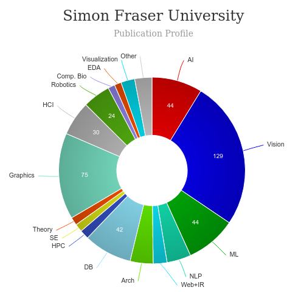

# MSc in Interactive Arts and Technology (SIAT)  [read more](https://www.sfu.ca/siat.html)
<iframe width="560" height="315" src="https://www.youtube.com/embed/xVD2gjPwCAg" frameborder="0" allow="accelerometer; autoplay; clipboard-write; encrypted-media; gyroscope; picture-in-picture" allowfullscreen></iframe>

## About MSc in Interactive Arts and Technology (SIAT) Simon Fraser
|   |   |
|---|---|
| Degree Offered |  **Master of Science (MSc)** |
| Other Degrees Offered| **Bachelor of Science, [Master of Arts(MA)](http://www.sfu.ca/students/calendar/2021/spring/programs/interactive-arts-and-technology/master-of-arts.html), [Doctor of Philosophy (PhD)](http://www.sfu.ca/students/calendar/2019/spring/programs/interactive-arts-and-technology/doctor-of-philosophy.html)**|
| Duration       | **2 year** |
| Location       | **Surrey, Canada**          |
| Total Credits  | **30**                           | 
|Deadline| **January 31**  |
|Information Session Conducted| ✅ [click here to register](https://www.sfu.ca/students/admission/campus-tours/webinars/all-students.html) |

---

## Entry Requirements for MSc in Interactive Arts and Technology (SIAT) Simon Fraser  [read more](https://www.sfu.ca/content/dam/sfu/siat/Graduate/Forms/SIAT_Graduate_Application_Document_Checklist.pdf)

|   |   |
|---|---|
| GRE | ❌ |
| TOEFL**       | **93** (for non-native speakers)|
|IELTS|**7.0**|
| Personal Statement       | ✅          |
|Personal Statement Word limit| **-** |
| Letter of Recommendation  | **2**                           | 
|Resume / CV|✅|
|Transcripts|✅ (unofficial) |
|Portfolio / Video Interview|✅ (if strongly considered for selection) |
|Application Fee| **$100** |

**English proficiency can be shown in many ways, click [here](https://www.sfu.ca/students/admission/admission-requirements/english-language-requirement.html) for more information

### Personal Statement Prompt
Read [here](http://www.sfu.ca/olc/blog/csi-blog/how-write-your-way-grad-school)

---

## Cost of attendence for MSc in Interactive Arts and Technology (SIAT) Simon Fraser [read more](https://www.sfu.ca/gradstudies/apply/tuition-and-fees/tuition-types.html)
|   |   |
|---|---|
| Cost (per term) (in-state)      | **$1,946.94**          |
| Cost (per term) (out-of-state)      | **$1,946.94**      |
|Approx. Total Cost| **11,682$ (≈ US$8,232)**|

---

## What's special about MSc in Interactive Arts and Technology (SIAT) Simon Fraser?

### Research Themes [read more](https://www.sfu.ca/siat/research/themes.html)
Research by faculty and students at SIAT is notable for its interdisciplinary focus on applied and use-inspired research, as well as collaboration with other researchers and external partners.  We are boundary crossers, developing new research approaches and methodologies to explore the possibilities created by the design of technology for humans.

### Funding
funding in the form of scholarships and/or research and teaching assistantships during the course of their program

### Mentorship
mentorship in interdisciplinary research methods and various forms of dissemination, such as academic publishing, conference presentation, project curation and exhibition

---

## MSc in Interactive Arts and Technology (SIAT) Simon Fraser Ranking
||
|---|---|
|QS Global World University Rankings 2021.| **#323**|

---

## Faculty at MSc in Interactive Arts and Technology (SIAT) Simon Fraser [read more](https://www.sfu.ca/siat/people/research-faculty.html) 
Research faculty are engaged in research, and also teach and supervise undergraduate and graduate students.

Visit [CSRankings](http://csrankings.org/#/index?all&us) for more stats 

---

## Research Areas at MSc in Interactive Arts and Technology (SIAT) Simon Fraser [read more](https://www.sfu.ca/siat/research/themes.html)
* Interactive Computing
* Media
* Design
* People
* Science of Interaction

---

## Careers after MSc in Interactive Arts and Technology (SIAT) Simon Fraser [read more](https://www.sfu.ca/career/WCID/fcat/SIAT.html)
If you want to study the future with other technologists, artists and designers, then you will be interested in this program. Study team management and human relations while building technical skills.

### Job Titles

---

## Social Handles of the program

* 🐦  [SIAT on Twitter ](https://twitter.com/siatsfu)  
* 💢  [SIAT on Instagram ](https://www.instagram.com/siatsfu) 
* 🛑  [SIAT on Youtube](https://www.youtube.com/channel/UCOUfpiMiDpPKxPtAag8V0Mw)
* 🌀  [SIAT News](https://www.sfu.ca/siat/stories/siat-news.html)

---

## Housing (off-campus & on-campus) links for Simon Fraser University
* [SFUResidences](https://www.facebook.com/SFUResidences/)
* [SFU Real Estate for Sale](https://www.facebook.com/SFUhomes/)
