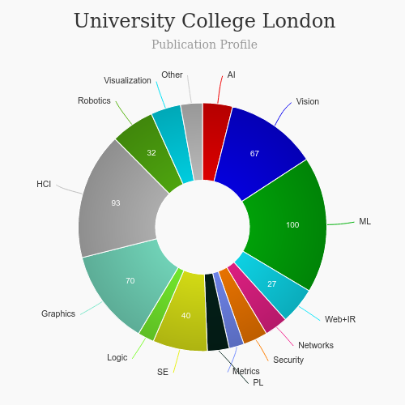

# Human-Computer Interaction MSc [🔗](https://www.ucl.ac.uk/prospective-students/graduate/taught-degrees/human-computer-interaction-msc)
<iframe width="560" height="315" src="https://www.youtube.com/embed/nc_vRPg_Puo" frameborder="0" allow="accelerometer; autoplay; clipboard-write; encrypted-media; gyroscope; picture-in-picture" allowfullscreen></iframe>

### About
---
|   |   |
|---|---|
| Degree Offered |  **Master of Science (MSc)** |
| Other Degrees Offered| **-**|
| Duration       | **1 year**(full-time), **2 year**(part-time)                      |
| Location       | **London, UK**          |
| Total Credits  | **180**                           | 
| Program Offered| **FALL**|
|Deadline| **March 12**  |
|Admission Type| **Regular Decision** |
|Information Session Conducted| ✅ [click here to register](https://www.ucl.ac.uk/prospective-students/open-days/graduate-open-days) |

### Entry Requirements [🔗](https://www.ucl.ac.uk/pals/study/masters/msc-human-computer-interaction)
---
|   |   |
|---|---|
| GRE | ❌ |
| TOEFL       | **109 with 24/30 in reading and writing and 20/30 in speaking and listening.** (for non-native speakers)|
|IELTS|**Overall grade of 7.5 with a minimum of 6.5 in each of the subtests.**(for non-native speakers)||
| Personal Statement       | ✅          |
|Personal Statement Word limit| **two sides of A4 paper maximum** |
| Letter of Recommendation  | **3**                           | 
|Resume / CV|✅|
|Transcripts|✅ (unofficial) |
|Portfolio|💡 (optional) |
|Application Fee| **$85** |

#### Personal Statement Prompt
1. Describe your interest in the subject and in this MSc/PgDip/PgCert programme. Looking at the modules on the programme, which ones interest you most and why? If you are enrolling in the MSc programme, do you have a particular research project in mind? Are there other reasons why you are applying to this course?

2. Briefly describe your future plans and commitment to the subject and how completion of this MSc programme will help you obtain your career goals.

3. Describe how your work experience or studies have prepared you for this course.

4. You do not need to include a Portfolio. However, if you wish to do so please include it in the same file as either your CV or your Personal Statement. A Portfolio does not replace a personal statement.

### Cost
---
|   |   |
|---|---|
| UK      | **£12,500** (FT) **£6,250** (PT)          |
| Overseas      | **£31,200** (FT) **£15,600** (PT)      |
---

## What's special?

his programme is taught by the [UCL Interaction Centre (UCLIC)](https://uclic.ucl.ac.uk), a world leading Centre of Excellence in Human-Computer Interaction, working collaboratively with industry and the research community. UCLIC, and before it the UCL Ergonomics Unit, have provided training in this field for over thirty years. We have excellent links with industry partners, offer students a weekly industry speaker series and run visits to consultancies and field sites.

Our modules use a combination of lectures and practical activities. Activities are often structured around individual or group projects, such as the evaluation of a system or the creation of a prototype. Assessments are varied and include design portfolios, presentations, videos and reflective reports as well as academic essays and exams.

The MSc research project allows students to undertake cutting-edge research in human-computer interaction. Many former projects have been published and presented at leading international conferences.

### Faculty [🔗](https://uclic.ucl.ac.uk/people)
UCLIC is a world leading Centre of Excellence in Human-Computer Interaction teaching and research, studying interactions between people and technology, drawing on the best scientific traditions in Computer Science and Human Sciences, and working collaboratively with the research community and industry. It is directed by Professor Yvonne Rogers and is housed jointly between the Department of Computer Science and the Division of Psychology and Language Sciences. During the last two years it has grown to over 40 interdisciplinary researchers (12 faculty staff, 6 post docs, 30 PhD students), working in a diversity of areas including ubiquitous computing, pervasive healthcare, behavioural change, in-the-wild studies, task performance, adaptive interfaces, design practice, affect and emotion, and new interaction techniques.

#### ** Visit [CSRankings](http://csrankings.org/#/index?all&uk) for more stats 

---

### Research Areas
* Affective Computing [🔗](https://uclic.ucl.ac.uk/research/affective-computing)
* Health and well being [🔗](https://uclic.ucl.ac.uk/research/health-and-well-being)
* Collaboration & Communication [🔗](https://uclic.ucl.ac.uk/research/collaboration-and-communication)

and many more [here](https://uclic.ucl.ac.uk/research) 

### Careers [🔗](https://www.ucl.ac.uk/pals/study/masters/msc-human-computer-interaction)
> Our graduates are employed by technology multinationals, start-ups, government agencies, consultancies and in academia. They take up roles such as User Experience (UX) Researchers, Interaction Designers, Usability Specialists and Information Architects. Many progress to senior roles within a few years of graduation. This degree is highly regarded by our colleagues in industry. Along with developing HCI research skills, the programme allows students to demonstrate skills in presenting, writing and collaboration that are valued by employers. We have a large network of alumni working in London and across the world. Many of them are involved with our industry speaker series and careers events, and they regularly send opportunities to our jobs mailing list for recent graduates.

---
## Social Handles of the program

* 🐦  [UCLIC on Twitter ](https://twitter.com/uclic?lang=en)  
* 💢  [UCL on Instagram ](https://www.instagram.com/ucl/) 
* 🛑  [UCL on Youtube](https://www.youtube.com/ucltv)
* 🌀  [UCL News](https://www.ucl.ac.uk/events/)

---
