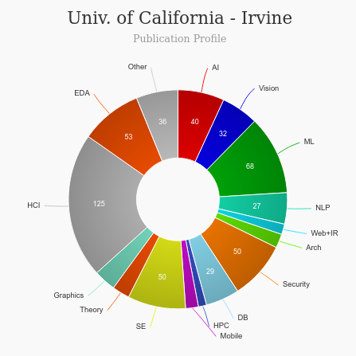

# Master of Human-Computer Interaction & Design Program(MHCID) [🔗](https://mhcid.ics.uci.edu/)
<iframe width="560" height="315" src="https://www.youtube.com/embed/zviMRmZI4qI" frameborder="0" allow="accelerometer; autoplay; clipboard-write; encrypted-media; gyroscope; picture-in-picture" allowfullscreen></iframe>

### About
---
|   |   |
|---|---|
| Degree Offered |  **Master of Science** |
| Other Degrees Offered| **Master of Informatics**|
| Duration       | **1 year**                      |
|Classes|**in-person**(only local residants of US) as well as **Online**|
| Location       | **Irvine, California**          |                         | 
| Program Offered| **FALL**|
|Deadline| **March 31**  |
|Admission Type| **Regular Decision** |
|Information Session Conducted| ✅ [click here to register](https://mhcid.ics.uci.edu/admissions/online-information-sessions/) |

### Entry Requirements
---
|   |   |
|---|---|
| GRE or Portfolio |  ✅ (Portfolio Recommended) |
| TOEFL      | **80** (for non-native speakers. read [more](https://grad.uci.edu/admissions/applying-to-uci/english-proficiency.php))|
| Personal Statement       | ✅          |
|Personal Statement Word limit| **-** |
| Letter of Recommendation  | **3**                           | 
|Resume / CV|✅|
|Transcripts|✅ (unofficial) |
|Application Fee| **$105** |

* International Students Notice
>If you are here already on some kind of non-education related visa (marriage and family, work, etc.), you should be eligible to enroll in our program without trouble. However, we encourage you to check with our international center as well as an immigration attorney. You do not need a student visa to join our program, and therefore we do not support you in getting one through the program. Because it is low-residency, meaning we do not require you to be on campus for more than a week at at time, we do not at this time have the ability to offer I-20s. Again, for additional questions, please consult with our international center and an immigration attorney.

#### Personal Statement Prompt
> Tell us a bit about why you want to join this program, where you see this program fitting in to your broader career trajectory, your future career goals, and so on.

### Cost
---
|   |   |
|---|---|
| Total Cost (in-state)      | **$51,800**          |
| Total Cost (out-of-state)      | **$51,800**      |
---

### Subjects

## What's special?

* **Learning in a year** [🔗](https://www.hcde.washington.edu/research/directed)
In just one year, students will learn: 
    * Theories of human behavior and cognition
    * To develop user facing software, including high and low fidelity prototypes
    * The place for user experience in the software development life cycle
    Visual design
    * Empirical methods and analysis
    * Ideation and design processes
    * To develop personas, scenarios, and storyboards for explaining user needs and design solutions
    * To communicate effectively with clients, software developers, and within teams
    * Legal requirements for accessible systems and principles of universal design
    * Current trends in user experience

* **Capstone Project** [🔗](https://mhcid.ics.uci.edu/program/capstone-projects/)
> Capstone projects occur over the final six months of the program and are focused on bringing together all of the skills and knowledge developed throughout the project. Project teams work together to solve a variety of user experience challenges in nearly any domain (education, the environment, healthcare, retail, and more) working with an external client. Iterative research, design, development, and evaluation are the keys to success in the capstone projects. All projects are presented during the Summer Finale at the end of the program.

* **UX Career Conference** [🔗](https://mhcid.ics.uci.edu/program/events/career-conference/)
> UC Irvine’s Executive Masters of Human-Computer Interaction and Design Program will host their annual UX Career Conference on Friday, September 10, 2021, This mini-conference is specifically designed for  UX professionals, industry executives, and UX recruiters. More information coming soon.

### Course Ranking
---
|||
|---|---|---|
| Top 50 Best Value UX Design Graduate Programs  | **#3**  |valuecolleges.com | 
| Top UX School      | **#1**      | topuxschool.com (other)|
---

### Faculty [🔗](https://mhcid.ics.uci.edu/people/mhcid-faculty-and-staff/) 
The MHCID program is housed in the Department of Informatics at UC Irvine, a leading department in the intersection of people, design, and technology. The department is home to four ACM fellows, four members of the CHI Academy, three endowed chairs, and numerous winners of other prestigious awards. The MHCID program draws faculty members from a myriad of backgrounds to create a rich environment in which students can draw upon a wide range of expertise. Faculty come from across UCI and from industry. Students in the MHCID program will have the opportunity to interact closely with these faculty and with the prestigious members of our industry advisory board.

#### ** Visit [CSRankings](http://csrankings.org/#/index?all&us) for more stats 

---
### Research Areas
> Project teams work together to solve a variety of user experience challenges in nearly any domain (education, the environment, healthcare, retail, and more) working with an external client. 

### Careers [🔗](https://www.hcde.washington.edu/future/careers)
> Yes! Our Program Director works alongside student affairs, our industry advisory board, and the program faculty to support career development and placement.

---
## Social Handles of the program

* 🐦  [MHCID on Twitter ](https://twitter.com/hashtag/mhcid?lang=en)  
* 💢  [UCI on Instagram ](https://www.instagram.com/ucirvine/?hl=en) 
* 🛑  [MHCID on Youtube](https://www.youtube.com/channel/UCF6U5Z2Ok9wmHcXsQK2OHgw)

---

