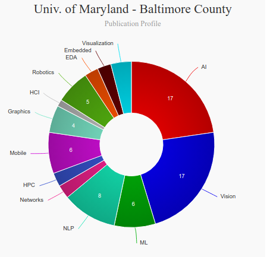

# Master of Science in Human-Centered Computing (HCC)[🔗](https://informationsystems.umbc.edu/home/graduate-programs/master-of-science-programs/master-of-science-in-human-centered-computing-hcc/)

### About
---
|   |   |
|---|---|
| Degree Offered |  **Master of Science** |
| Other Degrees Offered| **Phd**|
| Duration       | **2 year**                      |
| Location       | **Maryland, Baltimore County**          |
| Total Credits  | **30**                           | 
| Program Offered| **SPRING, FALL**|
|Deadline| **Spring - October 01, Fall - May 01**  |
|Offer Made| **Fastest Decision**|
|Admission Type| **Rolling Based Decision** |
|STEM| ✅ |
|Information Session Conducted| ❌ |

### Entry Requirements
---
|   |   |
|---|---|
| GRE | ❌ |
| TOEFL       | **80** (for non-native speakers)|
| Personal Statement       | ✅          |
|Personal Statement Word limit| **-** |
| Letter of Recommendation  | **3**                           | 
|Resume / CV|✅|
|Transcripts|✅ ([unoffical transcript or Credential Evaluation](https://gradschool.umbc.edu/admissions/international/)|
|Portfolio|❌ |
|Application Fee| **$50** |

#### Personal Statement Prompt
Read the guide [here](https://careers.umbc.edu/students/gradschool/personal-statement/)

### Cost
---
|   |   |
|---|---|
| Cost (per Credit) (in-state)      | **$659.00**          |
| Cost (per Credit) (out-of-state)      | **$1,132**      |
|Approx. Total Cost| **$19,770** (in-state) and **$33,960** (out-state)|
---

### Subjects

## What's special?

* **Multiple Tracks** [🔗](https://informationsystems.umbc.edu/home/graduate-programs/master-of-science-programs/master-of-science-in-human-centered-computing-hcc/)
> The MS program in HCC is an interdisciplinary program that has been training HCC practitioners and researchers since 2007. The program has two tracks: a Practitioner Track for those who wish to become user experience, information architecture, or usability professionals and a Research Track for those who are interested in pursuing a Master’s Thesis and possibly apply to a PhD program. Graduates from our program have moved on to be UX directors in both government and industrial positions, and graduates from the research track have joined top HCC PhD research programs.

* **ISRC Research** [🔗](https://isrc.umbc.edu/)
> The Interactive Systems Research Center (ISRC) acts as a bridge for faculty across the UMBC campus with expertise in designing, building, or studying uses of interactive computing systems. It facilitates the sharing of resources and experience in solving computing problems from a user-centered perspective grounded in user needs and not in simply applying previously designed solutions to new domains.

### Course Ranking
---
|||
|---|---|---|
| Top 50 Best Value UX Design Graduate Programs  | **#33**  |valuecolleges.com | 
| Top UX School      | **#37**      | topuxschool.com|
---
### Faculty [🔗](https://mhcid.washington.edu/faculty/)
Faculty in the department of HCC at UMBC collaborate throughout the university and beyond on their research.

#### ** Visit [CSRankings](http://csrankings.org/#/index?all&us) for more stats 

---
### Research Areas

* Interactive Systems Research Center (ISRC) [🔗](https://isrc.umbc.edu/)
> The Interactive Systems Research Center (ISRC) acts as a bridge for faculty across the UMBC campus with expertise in designing, building, or studying uses of interactive computing systems. It facilitates the sharing of resources and experience in solving computing problems from a user-centered perspective grounded in user needs and not in simply applying previously designed solutions to new domains.

### Careers [🔗](https://www.hcde.washington.edu/future/careers)
> Graduates from the University of Washington's department of Human Centered Design & Engineering find careers as designers and researchers who improve people's interactions with technology and the world around them.

#### Job Titles
* User Experience Design
* User Research

---
## Social Handles of the program

* 🐦  [UMBC on Twitter ](https://twitter.com/UMBC)  
* 💢  [UMBC on Instagram ](https://www.instagram.com/umbclife/?hl=en) 
* 🛑  [UMBC on Youtube](https://www.youtube.com/channel/UCblU02pAw9C5jnDZSGNs_Hw)
* 🌀  [UMBC News](https://news.umbc.edu/)

---

## Housing (off-campus & on-campus) links
* [Resedential Life @ UMBC](https://reslife.umbc.edu/)
* [University of Maryland, Baltimore (UMB) Housing, Sublets, & Roommates](https://www.facebook.com/groups/1947340111964457/)