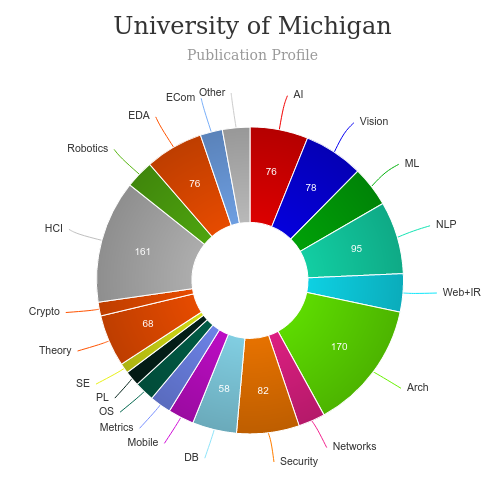

# Master of Science in Information [🔗](https://www.si.umich.edu/programs/master-science-information)
<iframe width="560" height="315" src="https://www.youtube.com/embed/ankqzzMaNGM" frameborder="0" allow="accelerometer; autoplay; clipboard-write; encrypted-media; gyroscope; picture-in-picture" allowfullscreen></iframe>

# About Master of Science in Information with UX Concentration - UMich
---
|   |   |
|---|---|
| Degree Offered |  **Master of Science (with HCI specialization)** |
| Other Degrees Offered| **Bachelor of Science**|
| Duration       | **2 year**                      |
| Location       | **Ann Arbor, Michigan**          |
| Total Credits  | **48**                           | 
| Program Offered| **FALL**|
|Deadline| **January 15**  |
|Offer Made| **March 15**|
|Admission Type| **Regular Decision** |
|STEM| ✅ |
|Information Session Conducted| ✅ [click here to register](https://www.applyweb.com/fixie/form/s/T3X1h36) |

# Entry Requirements for Master of Science in Information with UX Concentration - UMich
---
|   |   |
|---|---|
| GRE | ❌ |
| TOEFL**       | **102** (for non-native speakers)|
| Personal Statement       | ✅          |
|Personal Statement Word limit| **one to two (1-2) pages double-spaced.** |
| Letter of Recommendation  | **3**                           | 
|Resume / CV|✅|
|Transcripts|✅ (unofficial) |
|Portfolio|❌ |
|Application Fee| **$90** |
|Short Essay Prompts| |
**English proficiency can be shown in many ways, click [here](https://www.si.umich.edu/programs/master-science-information/how-do-i-apply) for more information

## Personal Statement Prompt
> How have your background and life experiences, including cultural, geographical, financial, educational or other opportunities or challenges, motivated your decision to pursue a graduate degree at the University of Michigan?

## Short Essay Prompts

Within the online application, you will be asked to respond to the following questions based on your exploration of the University of Michigan School of Information (UMSI) website, as well as your own reflection on your academic abilities, experiences, and personal qualities. You are welcome to add comments from your readings, observations, and experience. Each question should be answered in 250 words or less. At the University of Michigan School of Information, we highly value academic integrity. Please be sure that any essay content that is not your own original thoughts is properly attributed.

Tip for manually entered text:

You are encouraged to compose your essay in a Word document and then copy-and-paste it into the essay field.

* What are the critical issues in the field of information?
* What are your aspirations in the field of information?
* What is your understanding of the School of Information?
* How will a UMSI education help you reach your aspirations?
* What would you contribute to the UMSI community and to the field as a whole?

# Cost of attendence for Master of Science in Information with UX Concentration - UMich
---
|   |   |
|---|---|
| Cost (per term) (in-state)      | **$11,945**          |
| Cost (per Credit) (out-of-state)      | **$24,102**      |
|Approx. Total Cost| **$47,780** (in-state),  **$96,408** (out-of-state) |
---

# What's special about Master of Science in Information with UX Concentration - UMich?

* **Areas of interest** [🔗](https://www.si.umich.edu/programs/master-science-information/areas-interest)

    * Data science, data analytics, and computational social science
    * Digital archives, library science, and preservation
    * User experience (UX) research and design, human computer interaction (HCI), and social computing

* **Dual degree programs** [🔗](https://www.si.umich.edu/programs/master-science-information/dual-degree-programs)
> UMSI offers dual-degree programs to help students meet their specific career interests. In addition to the formalized dual degrees below, students can also initiate a dual degree with any other academic unit on campus.

* **Engaged learning** [🔗](https://www.si.umich.edu/programs/master-science-information/engaged-learning)
> At UMSI, MSI students have the opportunity to enhance their educational experience by participating in engaged learning. Engaged learning is high-impact and experiential learning. It happens in environments where students from multiple disciplines collaborate on real-world, ambiguous and unscripted challenges. Since the School of Information’s founding in 1996, this form of educational practice has been central to the way we teach and prepare students to be change agents in their careers in industry and the public sector, in entrepreneurial activities, and in their service to the world. 

* **Shanghai Jiao Tong University partnership** [🔗](https://www.si.umich.edu/programs/master-science-information/shanghai-jiao-tong-university-partnership)
> A strategic partnership between University of Michigan and Shanghai Jiao Tong University (SJTU) led to the founding of the UM-SJTU Joint Institute (JI) to cultivate a new generation of leaders able to cooperate and innovate in a global context. The collaboration between the two universities, which started in 2006 with engineering, has now expanded to several University of Michigan schools and departments including business, science and the School of Information. Every year more than 150 SJTU students come to U-M through the dual degree or joint graduate programs.

# Master of Science in Information with UX Concentration - UMich Course Ranking
---
|||
|---|---|---|
| U.S. News & World Report (2017) Best Graduate School   | **#1**  |- | 
| Top UX School      | **#15**      | topuxschool.com|
|Top UX Graduate Degree Programs| **#4**| usertesting.com|
---

# Faculty at Master of Science in Information with UX Concentration - UMich [🔗](https://www.si.umich.edu/people/directory/faculty) 
Faculty in the department of UMSI  collaborate throughout the university and beyond on their research.

## ** Visit [CSRankings](http://csrankings.org/#/index?all&us) for more stats 

---
# Research Areas at Master of Science in Information with UX Concentration - UMich[🔗](https://www.si.umich.edu/research/research-areas)
* Educational Technology and Learning Analytics
* Health Informatics
* Human Computer Interaction   
* ICT's and Social Change
* Information Economics
* Libary and Information Science
* Privacy and Security
* Science, Technology & Culture 
* Social Media and Social Computing
* Ubiquitous Computing

# Careers after Master of Science in Information with UX Concentration - UMich [🔗](https://www.si.umich.edu/programs/master-science-information/career-outcomes)
University of Michigan School of Information graduates obtain innovative, diverse professional jobs in a wide range of work settings and positions, from innovative tech startups and global healthcare organizations to nonprofits, libraries, Fortune 100 companies and some of the leading tech companies in the world. Positions range from entry level to senior level and management positions.

<iframe width="714" height="401" src="https://www.youtube.com/embed/D33Gf6qkn7c" frameborder="0" allow="accelerometer; autoplay; clipboard-write; encrypted-media; gyroscope; picture-in-picture" allowfullscreen></iframe>

View the employment report [here](https://www.si.umich.edu/sites/default/files/employment_report_msi_2020_f.pdf)

---
# Social Handles of the program

* 🐦  [UMSI on Twitter ](https://twitter.com/umsi)  
* 💢  [UMSI on Instagram ](https://www.instagram.com/umschoolofinformation/) 
* 🛑  [UMSI on Youtube](https://www.youtube.com/user/schoolofinformation)
* 🌀  [UMSI News](https://www.si.umich.edu/about-umsi/news)

---

# Housing (off-campus & on-campus) links
* [UMICH Student Housing](https://www.facebook.com/groups/223351171575348/)
* [UMICH Housing, Sublets & Roommates](https://www.facebook.com/groups/223351171575348/)
* [Student Life](https://www.si.umich.edu/programs/student-life-umsi)
