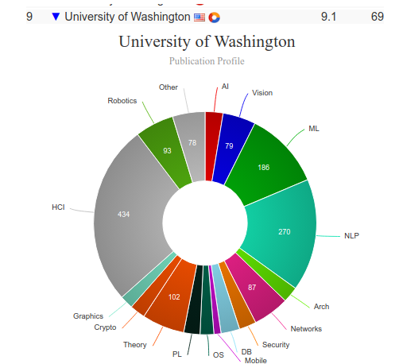

* [Master of Human Centered Design & Engineering (HCDE)](#hcde)
* [Master of Human-Computer Interaction and Design (MHCI+D)](#mhcid)

# Master of Human Centered Design & Engineering (HCDE) [🔗](https://www.hcde.washington.edu/ms)
<iframe width="560" height="315" src="https://www.youtube.com/embed/g4a2cAkV1f4" frameborder="0" allow="accelerometer; autoplay; clipboard-write; encrypted-media; gyroscope; picture-in-picture" allowfullscreen></iframe>

## About  Master of Human Centered Design & Engineering (HCDE) - University of Washington

|   |   |
|---|---|
| Degree Offered |  **Master of Science** |
| Other Degrees Offered| **Bachelor of Science, Certificate**|
| Duration       | **2 years**                      |
| Location       | **Seattle, Washington**          |
| Total Credits  | **48**                           | 
| Program Offered| **FALL**|
|Deadline| **January 15**  |
|Offer Made| **March 15**|
|Admission Type| **Regular Decision** |
|STEM| ✅ |
|Information Session Conducted| ✅ [click here to register](https://www.hcde.washington.edu/information-sessions) |

---

## Entry Requirements for Master of Human Centered Design & Engineering (HCDE) - University of Washington

|   |   |
|---|---|
| GRE | ❌ |
| TOEFL**       | **106** (for non-native speakers)|
| Personal Statement       | ✅          |
|Personal Statement Word limit| **1200 words** |
| Letter of Recommendation  | **3**                           | 
|Resume / CV|✅|
|Transcripts|✅ (unofficial) |
|Portfolio|❌ |
|Application Fee| **$85** |

**English proficiency can be shown in many ways, click [here](https://grad.uw.edu/policies-procedures/graduate-school-memoranda/memo-8-graduate-school-english-language-proficiency-requirements/) for more information

### Personal Statement Prompt
How have your prior activities and experiences (e.g., things you have done at school, in the workplace, in your community, and/or extracurricular activities) prepared you for this program and this field? Please provide specific examples. [600 words maximum]

Please describe your particular interest in Human Centered Design & Engineering, and explain what specific elements of the program make it a good fit for you. How will this program assist you in your longer-term goals? Please provide specific examples. [600 words maximum]

---

## Cost of Attendence at Master of Human Centered Design & Engineering (HCDE) - University of Washington

|   |   |
|---|---|
| Cost (per Credit) (in-state)      | **$860**          |
| Cost (per Credit) (out-of-state)      | **$860**      |
|Approx. Total Cost| **$41,280**|

---

## What's special about Master of Human Centered Design & Engineering (HCDE) - University of Washington?

### DRG's (Directed Research Groups) [🔗](https://www.hcde.washington.edu/research/directed)
Faculty and research scientists in the department of Human Centered Design & Engineering run directed research groups, which offer students a wide range of opportunities to do hands-on work, from conducting usability tests for local companies all the way to collecting data on communication issues internationally.

### Microsoft Mentorship Program [🔗](https://www.hcde.washington.edu/microsoft-mentor)
UW’s Department of Human Centered Design & Engineering (HCDE) and the Microsoft Cloud + AI Studios team are continuing our year-long mentorship program for the 2020-21 academic year. 30-40 HCDE students will be matched with Microsoft mentors for one-on-one career coaching. Students will gain real world perspective and career guidance from working professionals in user research, UX design, content strategy, and product management.

### UX Speaker Series [🔗](https://www.hcde.washington.edu/ux)
In winter quarter, the Department of Human Centered Design & Engineering hosts a 10-week seminar series on User Experience (UX), where we welcome industry experts to speak about current issues and research in the field.

### Study abroad in London [🔗](https://www.hcde.washington.edu/london)
Join Human Centered Design & Engineering faculty members Drs. Brock Craft and Tyler Fox on an international exploration of Experience Design. London is a globally significant crossroads for creative cultures of all kinds, and has a thriving Design and UX scene. The city presents opportunities for developing a deeper understanding of how to engineer interactions and experiences. The program is designed for students who are eager to explore experience design in the diverse and rich context that is London.

---

## Master of Human Centered Design & Engineering (HCDE) - University of Washington Course Ranking
|||
|---|---|---|
| Top 50 Best Value UX Design Graduate Programs  | **#27**  |valuecolleges.com | 
| Top UX School      | **#3**      | topuxschool.com|
|Top UX Graduate Degree Programs| **#10**| usertesting.com|

---

## Faculty at Master of Human Centered Design & Engineering (HCDE) - University of Washington [🔗](https://www.hcde.washington.edu/faculty) 
Faculty in the department of Human Centered Design & Engineering at the University of Washington in Seattle collaborate throughout the university and beyond on their research.

Visit [CSRankings](http://csrankings.org/#/index?all&us) for more stats 

---

## Research Areas at Master of Human Centered Design & Engineering (HCDE) - University of Washington
* Influencing Behavior, Thinking, and Awareness [🔗](https://www.hcde.washington.edu/research/areas#influencing-behavior-thinking-and-awareness)
* Design for Emergent Collaborations and Organizations [🔗](https://www.hcde.washington.edu/research/areas#design-for-emergent-collaborations-and-organizations)
* Low Resource and Underserved Populations [🔗](https://www.hcde.washington.edu/research/areas#low-resource-and-underserved-populations)
* Material and Embodied Technologies [🔗](https://www.hcde.washington.edu/research/areas#material-and-embodied-technologies-and-ubiquitous-computing)
* Data Science and Data Visualization [🔗](https://www.hcde.washington.edu/research/areas#data-visualization-and-big-data)
* Learning in Professional and Technical Environments [🔗](https://www.hcde.washington.edu/research/areas#learning-in-professional-and-technical-environments)

---

## Careers after Master of Human Centered Design & Engineering (HCDE) - University of Washington [🔗](https://www.hcde.washington.edu/future/careers)
Graduates from the University of Washington's department of Human Centered Design & Engineering find careers as designers and researchers who improve people's interactions with technology and the world around them.

### Job Titles
* 18% User Experience (UX) Designer
* 17% User Experience (UX) Researcher or User Researcher 
* 7% Software Engineer

### Salary Range
* 25% of our survey respondents reported making between **$100,000 and $120,000**. 
* 18% were making between **$80,000 and $100,000**; 
* 14% more than **$120,000** annually; 
* 11% between **$70,000 and $80,000**.

---
## Social Handles of the program

* 🐦  [Twitter ](https://twitter.com/hcdeuw?lang=en)  
* 💢  [Instagram ](https://www.instagram.com/hcdeuw/?hl=en) 
* 🛑  [Youtube](https://www.youtube.com/channel/UChzdu4-qUiC4IYPEUru9JFA)
* 🌀  [HCDE News](https://www.hcde.washington.edu/news)

---

# Master of Human-Computer Interaction and Design (MHCI+D)  [🔗](https://mhcid.washington.edu/)
<iframe width="560" height="315" src="https://www.youtube.com/embed/xeKw6LpDeTQ" frameborder="0" allow="accelerometer; autoplay; clipboard-write; encrypted-media; gyroscope; picture-in-picture" allowfullscreen></iframe>

|   |   |
|---|---|
| Degree Offered |  **Master of Science** |
| Other Degrees Offered| -|
| Duration       | **11 months**                      |
| Location       | **Seattle, Washington**          |
| Total Credits  | **46**                           | 
| Program Offered| **FALL**|
|Deadline| **January 15**  |
|Offer Made| **March 15**|
|Admission Type| **Regular Decision** |
|STEM| ✅ |
|Information Session Conducted| ✅ [click here to register](https://mhcid.washington.edu/how-to-learn-more/) |

---

## Entry Requirements for Master of Human-Computer Interaction and Design (MHCI+D) - University of Washington
|   |   |
|---|---|
| GRE | ❌ |
| TOEFL**       | **106** (for non-native speakers)|
| Personal Statement       | ✅          |
|Personal Statement Word limit| **500-800 words** |
| Letter of Recommendation  | **3**                           | 
|Resume / CV|✅|
|Transcripts|✅ (unofficial) |
|Portfolio|💡 (optional) |
|Application Fee| **$85** |

**English proficiency can be shown in many ways, click [here](https://grad.uw.edu/policies-procedures/graduate-school-memoranda/memo-8-graduate-school-english-language-proficiency-requirements/) for more information

### Personal Statement Prompt
describe your interest in HCI and design, and explain what specific elements of the MHCI+D Program make it a good fit for you. How have your prior experiences (at school and in the workplace if applicable) prepared you for this program and this field? How will this program assist you in your longer-term goals? The personal statement is your opportunity to present your goals and experience as they relate to human-computer interaction and design. We’re interested in how you see the field and this program from your own personal perspective.

---

## Cost of attendence for Master of Human-Computer Interaction and Design (MHCI+D) - University of Washington
|   |   |
|---|---|
| Cost (per Credit) (in-state)      | **$1,098**          |
| Cost (per Credit) (out-of-state)      | **$1,098**      |
|Approx. Total Cost| **$52,704**|

---

## What's special about Master of Human-Computer Interaction and Design (MHCI+D) - University of Washington?

### Capstone Projects [🔗](https://mhcid.washington.edu/capstone-projects/)
Capstone projects are focused on solving current problems in professional practice and may address domains such as health & wellbeing, the environment, education, assistive technology, retail, or travel. Student teams work with mentorship from industry advisors to apply iterative research, design, prototyping, and evaluation methods to produce a comprehensive solution or product design, and portfolio presentation.

### Career Conference [🔗](https://mhcid.washington.edu/career/)
MHCI+D’s annual Career Conference is a fantastic opportunity for industry and students to interact one-on-one and get to know each other. It’s not about who has jobs, it’s about building relationships with our graduates and they with you.

### The Curriculum
Learn about core and elective classes that create the MHCI+D experience [here](https://mhcid.washington.edu/curriculum/)

---

## Master of Human-Computer Interaction and Design (MHCI+D) - University of Washington Course Ranking
|||
|---|---|---|
| Top 50 Best Value UX Design Graduate Programs  | **#17**  |valuecolleges.com | 
| Top UX School      | **#3**      | topuxschool.com|

---

## Faculty at Master of Human-Computer Interaction and Design (MHCI+D) - University of Washington [🔗](https://mhcid.washington.edu/faculty/)
Faculty in the department of Human Centered Design & Engineering at the University of Washington in Seattle collaborate throughout the university and beyond on their research.

Visit [CSRankings](http://csrankings.org/#/index?all&us) for more stats 

---

## Careers after Master of Human-Computer Interaction and Design (MHCI+D) - University of Washington [🔗](https://mhcid.washington.edu/career-services/)
As a student in the MHCI+D Program, your main focus is on coursework and learning as much as possible in the one year you are here. Building your skills and knowledge during the program is the single most important means of preparing for your career.

### Job Titles
||||
|---|---|---|
|UX Designer 	|34%| 	62|
|Product Designer |	21% 	|39|
|Interaction Designer |	13% |	24|
|User Researcher 	|11% |	20|
|Design Technologist |	4% |	7|
|Other| 	16% |	30|

---

## Social Handlesof the program

* 🐦  [MHCID on Twitter ](https://twitter.com/uwmhcid)  
* 💢  [MHCID on Instagram ](https://www.instagram.com/uwmhcid/) 
* 🛑  [MHCID on Youtube](https://www.youtube.com/user/UWMHCID)
* 🌀  [MHCID Homepage](https://mhcid.washington.edu/)

---

## Housing (off-campus & on-campus) links for University of Washington
* [UW Student Housing](https://www.washington.edu/about/housing/)
* [University of Washington (UW) Housing, Sublets & Roommates](https://www.facebook.com/groups/445293202296621/)
* [University of Washington Housing, Rooms, Apartments, Sublets](https://www.facebook.com/groups/2010322712550585/)
