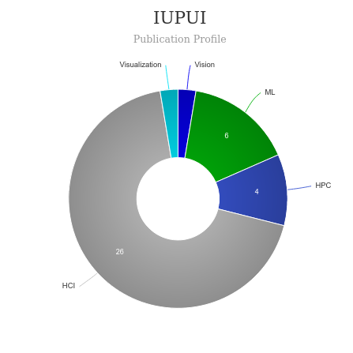

# Master of Human Computer Interaction (HCI) [🔗](https://soic.iupui.edu/hcc/graduate/hci/masters/)
<iframe width="560" height="315" src="https://www.youtube.com/embed/AvsY5_NjqJM" title="YouTube video player" frameborder="0" allow="accelerometer; autoplay; clipboard-write; encrypted-media; gyroscope; picture-in-picture" allowfullscreen></iframe>

# About Master of Human Computer Interaction (HCI) - IUPUI
|   |   |
|---|---|
| Degree Offered |  **Master of Science** |
|Other Degrees Offered | **Certificate, PHD**|
 Duration       | **2 years**                      |
| Location       | **Indianapolis, IN**          |
| Total Credits  | **36**                           | 
| Program Offered| **FALL, SPRING, [ONLINE](https://soic.iupui.edu/hcc/graduate/hci/masters/online-curriculum/)**|
|Deadline| Early Action: **January 15** Regular: **March 1 (all students)** ,**September 1** (international) **October 1** (domestic students)|
|Offer Made| **See [here](https://www.thegradcafe.com/survey/index.php?q=hci+iupui&t=a&o=p&pp=100)**|
|Admission Type| **Regular Decision** |
|STEM| ✅ |
|Information Session Conducted| ✅ [click here to register](https://soic.iupui.edu/admissions/visit/graduate-visit/) |

---

# Entry Requirements for Master of Human Computer Interaction (HCI) - IUPUI
|   |   |
|---|---|
| GRE | ✅ |
| TOEFL**       | **79** (for non-native speakers)|
|ILETS|**6.5**|
| Personal Statement       | ✅          |
|Personal Statement Word limit| **500-750 word** |
| Letter of Recommendation  | **3**                           | 
|Resume / CV|✅|
|Transcripts|✅ (unofficial) |
|Portfolio|✅ |
|Application Fee| **$70** |

**English proficiency can be shown in many ways, click [here](https://international.iupui.edu/admissions/how-apply/graduate/english.html) for more information

## Personal Statement Prompt
* Why you’re applying to the program
* Your post-graduation career plans

Read more [here](www.indiana.edu/~wts/pamphlets.shtml)

---

# Cost of Attendence at Master of Human Computer Interaction (HCI) - IUPUI
|   |   |
|---|---|
| Cost (per Credit) (in-state)      | **$420**          |
| Cost (per Credit) (out-of-state)      | **$1275**      |
|Approx. Total Cost| **$15,120** (in-state)  **$45,900** (out-of-state)|

---

# Scholorship & Funding
* Read about available scholorships [here](https://soic.iupui.edu/cost-financial-aid/scholarships/)
* Graduate Assistantship info [here](https://science.iupui.edu/cs/admissions/fin-aid-scholarships/index.html) 

---

# What's special about Master of Human Computer Interaction (HCI) - IUPUI?

## BALM Lab [🔗](https://balm.soic.iupui.edu/index.php)
The BALM Lab at IUPUI is dedicated to improving accessibility of the physical, digital, and social world. You can learn more about our ongoing projects, the members of our team, and current studies on this website.

## Convergent Media & Exploratory Technology Lab [🔗](https://comet.soic.iupui.edu/)
The COnvergent Media and Exploratory Technologies (COMET) Lab is an applied research laboratory in the Department of Human-Centered Computing, School of Informatics and Computing IUPUI where faculty and students work together to deliver web, mobile and interactive media solutions for projects submitted by units from the IUPUI campus, external organizations and the community at large.  

## USER (User Simulation and Experience Research) Lab [🔗](https://soic.iupui.edu/people/davide-bolchini/)
An incubator for user experience research.

---

# Master of Master of Human Computer Interaction (HCI) - IUPUI Course Ranking
|||
|---|---|---|
| Top 50 Best Value UX Design Graduate Programs  | **#40**  |valuecolleges.com | 
| Top UX School      | **#26**      | topuxschool.com|

---

# Faculty at Master of Human Computer Interaction (HCI) - IUPUI [🔗](https://soic.iupui.edu/hcc/graduate/hci/masters/) 
Faculty in the department of Human Computer Interaction at IUPUI collaborate throughout the university and beyond on their research.

Visit [CSRankings](http://csrankings.org/#/index?all&us) for more stats 

---

# Research Areas at Master of Human Computer Interaction (HCI) - IUPUI
* Android Science and Human-robot Interaction
* Interactive Accessibility for the Blind and Visually Impaired
* Medical and Clinical System Design
* Social Informatics, Technology and Society
* Game Design and Health Games
* Healthcare New Media Communications
* Web and Mobile Technologies
* Graphics, Visualization, Video and Animation

---

# Careers after Master of Human Computer Interaction (HCI) - IUPUI [🔗](https://soic.iupui.edu/careers/)
Graduates from the IUPUI's department of Human Computer Interactionfind careers as designers and researchers who improve people's interactions with technology and the world around them.

## Job Titles
* Interaction Designer
* Product Designer
* Product Manager
* Search Quality Analyst
* Senior Human Factors Engineer
* User Experience (UX) Designer
* UX Engineer
* UX Researcher
* UX Research Specialist
* User Interface (UI) Designer and Developer
* UI/UX Architect
See there job board [here](https://soic.iupui.edu/careers/students/jobs/)

## Salary Range
HCI graduates have found full-time jobs and internships with *Amazon, Ammunition Group, Apple, The Children’s Museum of Indianapolis, Cummins, Dell, Demandware, Eli Lilly and Co., Facebook, Fossil Group, Google, InfoSys, Intel Corp., Microsoft Research, Parkview Health, Raytheon Co., Roche Diagnostics, Salesforce.com, Samsung, SAP, Splunk, Studio Science, VMWare, Walmart Labs, Yahoo!,* and many other employers.

**$83,500** - AVERAGE STARTING SALARY AT GRADUATION

---

# Social Handles of the program

* 🐦  [Twitter ](https://twitter.com/IUPUInformatics)  
* 🛑  [Youtube](https://www.youtube.com/channel/UCK01Ot7DTFWXbTyxRKAQJmw)
* 🌀  [HCI News](https://soic.iupui.edu/news-topic/hcc/)

---

# Housing (off-campus & on-campus) links for IUPUI
* [IUPUI Student Housing](https://housing.iupui.edu/index.html)
* [IUPUI Housing and Residence Life](https://www.facebook.com/IUPUIHRL/)
* [IUPUI Off-Campus Housing](https://www.facebook.com/iupuioffcampushousing/)
* [Off campus Housing @ IUPUI](https://international.iupui.edu/indianapolis/housing/off-campus.html)