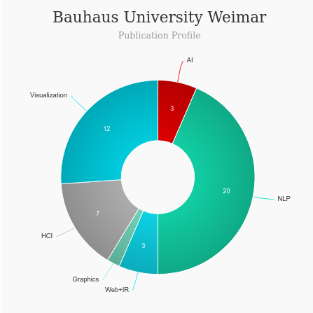

# Master of Human Computer Interaction [🔗](https://www.uni-weimar.de/en/media/studies/human-computer-interaction-msc/)
<iframe width="560" height="315" src="https://www.youtube.com/embed/D57GzQ6UuMc" title="YouTube video player" frameborder="0" allow="accelerometer; autoplay; clipboard-write; encrypted-media; gyroscope; picture-in-picture" allowfullscreen></iframe>

### About Master of Human Computer Interaction - Bauhaus-Universität Weimar
---
|   |   |
|---|---|
| Degree Offered |  **Master of Science** |
| Other Degrees Offered| **PHD**|
| Duration       | **2 years**                      |
| Location       | **Weimar, Germany**          |
| Total Credits  | **120 ECTS**                           | 
| Program Offered| **Summer, Winter**|
|Deadline| **31 march, 30 September**  |
|Admission Type| **Regular Decision** |
|Information Session Conducted| ❌ |

# Entry Requirements for Master of Human Computer Interaction - Bauhaus-Universität Weimar
---
|   |   |
|---|---|
| GRE | ❌ |
| TOEFL**       | **85** (for non-native speakers)|
|IELTS|**6.5** (the score of each test component must be at least 6,0)|
| Personal Statement       | ✅          |
|Personal Statement Word limit| **2 to 4 pages** |
| Letter of Recommendation  | ❌                           | 
|Resume / CV|❌|
|Transcripts|✅ (unofficial) |
|Portfolio|❌ |
|Application Fee| **EUR 75.00 (through uni-assist)** |

**English proficiency can be shown in many ways, click [here](https://www.uni-weimar.de/en/media/studies/human-computer-interaction-msc/application-procedure/) for more information

## Personal Statement Prompt
Explain the specific motivation for doing an HCI degree, and an overview of educational or work experience, in particular regarding projects, internships, extracurricular activities or research activity with relevance for HCI. Wherever possible, these activities should be documented. 

# Cost of Attendence at Master of Human Computer Interaction - Bauhaus-Universität Weimar
---
|   |   |
|---|---|
| Cost (per semester)      | **200 €**          |
|Approx. Total Cost | **800 €**|
---

# What's special about Master of Human Computer Interaction - Bauhaus-Universität Weimar?

## A Wide Range of Electives [🔗](https://www.uni-weimar.de/en/media/studies/human-computer-interaction-msc/curriculum-hci/)
The electives module allows for the inclusion of a range of courses from other programs, such as Media Studies, Media Management, Architecture and Urbanism, Media Art and Design, Product Design, Visual Communication, and others.  An additional HCI-related project may also be incorporated. 

## Digital Bauhaus Lab [🔗](https://www.uni-weimar.de/en/media/institutes/digital-bauhaus-lab/home/)
The Digital Bauhaus Lab is a new, interdisciplinary research center where Computer Scientists, Engineers, and Artists tackle major scientific and societal challenges of the information society.

## Skills from project-based studies
Science-oriented projects require a high level of independent acquisition of scientific knowledge and provide important job-related qualifications as well as the opportunity for students to propose, implement, and advocate their first independent research initiatives.

## Research orientation and publications [🔗](https://www.uni-weimar.de/en/media/chairs/computer-science-department/vr/research/hci/)
The students are often actively involved in international publishing activities, often due to research projects and student work. A significant proportion of the previous Master’s graduates have obtained their doctorate within and outside of Germany and work in academic or research-oriented environments.

# Faculty at Master of Human Computer Interaction - Bauhaus-Universität Weimar [🔗](https://www.uni-weimar.de/en/media/chairs/computer-science-department/vr/people/) 
Faculty in the department of Human Computer Interaction at the Bauhaus-Universität Weimar in Weimar collaborate throughout the university and beyond on their research.

## ** Visit [CSRankings](http://csrankings.org/#/index?all&us) for more stats 

---
# Research Areas at Master of Human Computer Interaction - Bauhaus-Universität Weimar
* Basic and applied research in Virtual Reality and 2D and 3D User Interfaces
* Visualization and rendering algorithms for very large image, volume and CAD datasets
* Information visualization of static and dynamic graphs
* Visual text analytics
* Real-time 3D capturing and reconstruction systems
* Real-time rendering
* Large model rendering
* 3D display technology
* Collaboration and multi-user VR
* Cultural heritage
* Digital humans
* User interfaces for cooperative action
* 3D displays
* 3D user interfaces and tangible tools
* Collaborative work
* Computer aided design

# Careers after Master of Human Computer Interaction - Bauhaus-Universität Weimar [🔗](https://www.uni-weimar.de/en/media/studies/human-computer-interaction-msc/career-prospects/)
The HCI Master was developed based on our experience with the longstanding Master of Computer Science for digital media. All CS4DM graduates have easily found employment in industry and science, in research and development departments of large companies (e.g. Volkswagen, BMW), research institutes (e.Fraunhofer) and at universities, and many are pursuing their doctorate.

## Job Titles
* UX/UI Designer
* UX Design-Technologist
* PhD

---
# Social Handles of the program

* 🐦  [Twitter ](https://twitter.com/bauhaus_uni?lang=en)  
* 💢  [Instagram ](https://www.instagram.com/bauhaus_uni/?hl=en) 
* 🛑  [Youtube](https://www.youtube.com/channel/UCgIceghh_oA6qa_4zO6vr2Q)
* 🌀  [HCDE News](https://www.uni-weimar.de/en/university/news/)

---

# Housing (off-campus & on-campus) links for Bauhaus-Universität Weimar
* [UW Accommodation](https://www.uni-weimar.de/en/university/international/to-weimar/exchange-students/i-want-to-study-at-bauhaus-universitaet/before-arrival/accommodation/)
* [Private Housing - www.wg-gesucht.de](https://www.wg-gesucht.de/)
