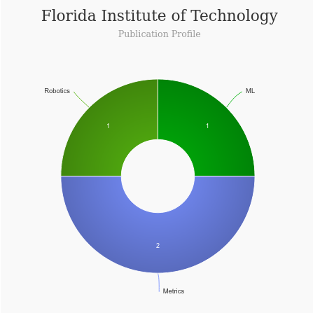

# Master of Human Centered Design (HCD) [🔗](https://www.fit.edu/programs/human-centered-design-ms/)
<iframe width="560" height="315" src="https://www.youtube.com/embed/qq2-6BaXx_0" title="YouTube video player" frameborder="0" allow="accelerometer; autoplay; clipboard-write; encrypted-media; gyroscope; picture-in-picture" allowfullscreen></iframe>

### About Master of Human-Centered Design - Florida Tech
---
|   |   |
|---|---|
| Degree Offered |  **Master of Science** |
| Other Degrees Offered| **ph.D**|
| Duration       | **2 years**                      |
| Location       | **Main Campus - Melbourne**          |
| Total Credits  | **30**                           | 
| Program Offered| **FALL,SPRING**|
|Deadline| **June 8** (FALL), **October 14** (SPRING), **January 15** (Fall Priority Deadline) |
|Admission Type| **Rolling Decision** |
|STEM| ✅ |
|Information Session Conducted| ❌  |

# Entry Requirements for Master of Human-Centered Design - Florida Tech
|   |   |
|---|---|
| GRE | ✅ |
| TOEFL**       | **79** (for non-native speakers)|
|IELTS| **6.0**|
| Personal Statement       | ✅          |
|Personal Statement Word limit| **300 words** |
| Letter of Recommendation  | **1**                           | 
|Resume / CV|✅|
|Transcripts|✅ (unofficial) |
|Portfolio|❌ |
|Application Fee| **$85** |

**English proficiency can be shown in many ways, click [here](https://catalog.fit.edu/preview_program.php?catoid=9&poid=3309&hl=%22english+proficiency%22&returnto=search) for more information

## Personal Statement Prompt
 This statement of approximately 300 words should include a discussion of intended graduate study, professional career goals, and past and proposed activities in the field of study.

# Cost of Attendence at Master of Human-Centered Design - Florida Tech
---
|   |   |
|---|---|
| Cost (per Credit) (in-state)      | **$1,241**          |
| Cost (per Credit) (out-of-state)      | **$1,241**      |
|Approx. Total Cost| **$37,230**|
---

# What's special about Master of Human-Centered Design - Florida Tech?

## Specializations 
Studying for a master's degree in human-centered design from Florida Institute of Technology is an interdisciplinary experience that covers other academic disciplines ranging from human-computer interaction and artificial intelligence to architecture, ethnographic design, and crisis management. Human-centered design, innovation and art also provide courses on creativity and design thinking, functional analysis, industrial design and user experience.

## Human-Centered Design Institute [🔗](https://research.fit.edu/human-centered-design-institute/)
The Human-Centered Design Institute (HCDi) develops education and research in various domains such as aeronautics, space, energy production and management, health care, and education. We have research and innovation labs, such as the commercial aviation cockpit design lab (equipped with A320 and B737 fully equipped flight deck simulators) and 3D-moving spaceship simulator. We also have an advanced interaction research lab where various kinds of novel tangible interactive systems can be designed and tested. 

## ATLAS Lab [🔗](https://research.fit.edu/atlas/)
The ATLAS lab studies how individuals make decisions under stress and uncertainty.  This includes utilizing physiological measures to assess stress and workload, in hand with granular process-level measures of decision making and performance.  It has also resulted in development of a framework of factors which influence how individuals make decisions with conflicting information.

## RiSE Lab [🔗](https://sites.google.com/view/rise-lab)
Research in Information Science for Engineeringh context that is London.

# Faculty at Master of Master of Human-Centered Design - Florida Tech [🔗](https://catalog.fit.edu/content.php?catoid=4&navoid=97) 
Faculty in the department of Human Centered Design Florida Tech collaborate throughout the university and beyond on their research.

## ** Visit [CSRankings](http://csrankings.org/#/index?all&us) for more stats 

---
# Research Areas at Master of Human-Centered Design - Florida Tech
* Cognitive engineering: human-centered automation, scenario-based design, cognitive modeling and function analysis, risk taking and management, situational awareness, decision-making, integration and use cases.

* Advanced interaction media: input techniques, tangible and haptic interaction, multimodal interaction, ubiquitous computing and information flows, surface computing, information visualization, use experience and usability engineering, ethnographical design, computer-supported cooperative work.

* Complexity analysis in human-centered design: complexity theories, collaborative system engineering, systems of systems, adaptive systems, human-centered requirement engineering, socio-cognitive stability, resilience, accident investigation and analysis, traceability, design for simplicity, product and practice maturity.

* Life-critical systems: research across domains such as aerospace, nuclear, medicine, ground transportation and ecosystems, and design for safety, efficiency and comfort.

* Human-centered organization design and management: knowledge management, resilience engineering, certification, product integration, complexity research, organizational automation, computer-supported meeting environments.

* Modeling and simulation: computer-aided design, life-cycled product management, discrete-event simulations, multi-agent simulations, mathematical models for simulation, human-in-the-loop simulations.

* Creativity and design thinking: how to state and solve messy problems using out-of-the-box approaches; how to design in a team and recruit those who will be potential recipients of a product; storytelling and storyboarding; cartoon generation; participatory design; conceptual and parallel thinking.

* Industrial design: human-centered design of product interior; automotive and aerospace interiors; interfaces and objects crafted for young designers to provide understanding of complex and dynamic interactive environments; design drivers and requirements.

* Function analysis: task, activity and work analysis; the concept of emergence in human-centered design; levels of automation; cognitive function networks; human-machine cooperation; and dynamic function allocation.

* Usability engineering: sensorimotor, cognitive and social models and measures; ergonomic guidelines and recommendations; human-centered learning retention; human error management; efficiency; pleasure; emotional aspects; stress; fatigue; workload; and acceptability.

# Careers after Master of Human-Centered Design - Florida Tech [🔗](https://www.fit.edu/programs/human-centered-design-ms/)
From the systems engineer to the cognitive scientist, human-centered design graduates find themselves in the heart of the design process in an industrial design career, creating new technologies in such careers as designing advanced cockpits, control rooms, educational tools, simulators and new living environments, to name a few.

---
# Social Handles of the program

* 🐦  [FIT HCD at Twitter ](https://twitter.com/fit_hcd)  
* 💢  [Instagram ](https://www.instagram.com/floridatech/?hl=en) 
* 🛑  [Youtube](https://www.youtube.com/channel/UCtinlczaAzxXS4I6CiMdKYA)
* 🌀  [FIT HCD News](https://news.fit.edu/tag/human-centered-design/)

---

# Housing (off-campus & on-campus) links for Florida Tech
* [Florida Tech Student Housing](https://www.fit.edu/housing/)
* [Florida Institute of Technology (FIT) Housing, Sublets & Roommates](https://www.facebook.com/groups/361416567401483/)
* [UF Off Campus Housing, Subleases, Roommates, Apartments - Gainesville](https://www.facebook.com/groups/UFSubleasesRoommates/)
