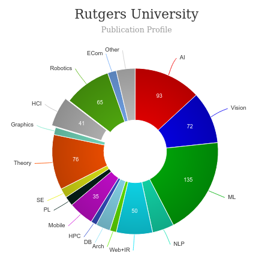

# Master of Business & Science (MBS) with concentration in User Experience Design (UXD)  [🔗](https://mbs.rutgers.edu/program/user-experience-design-uxd)
<iframe width="560" height="315" src="https://www.youtube.com/embed/kVOxv9v7F-8" title="YouTube video player" frameborder="0" allow="accelerometer; autoplay; clipboard-write; encrypted-media; gyroscope; picture-in-picture" allowfullscreen></iframe>

---
|   |   |
|---|---|
| Degree Offered |  **Master of Business & Science (MBS)** |
| Other Degrees Offered| **Certificate**|
| Duration       | **1.5-2 years**                      |
| Location       | **New Brunswick, New Jersey or [ONLINE](https://mbs.rutgers.edu/master-business-and-science-degree-online-apply-now)**          |
| Total Credits  | **43**                           | 
| Program Offered| **FALL, SPRING**|
|Deadline| **April 1st** (Fall)  **October 1st** (Spring)  |
|Offer Made| **in 3 weeks**|
|Admission Type| **Regular Decision** |
|STEM| ✅ |
|Information Session Conducted| ✅ [click here to register](https://mbs.rutgers.edu/events?field_event_type_value=I) |

# Entry Requirements for Master of Business & Science (MBS) - Rutgers University
---
|   |   |
|---|---|
| GRE | ❌ In place of the GRE, we are asking applicants to fill out a series of program questions. Please download the GRE Program Questions document [HERE](https://mbs.rutgers.edu/sites/mbslive/files/images/mbs_program_questions_form.pdf). |
| TOEFL**       | **writing 22, speaking 23, reading 21, listening 17** (for non-native speakers)|
| Personal Statement       | ✅          |
|Personal Statement Word limit| **-** |
| Letter of Recommendation  | **2**                           | 
|Resume / CV|✅|
|Transcripts|✅ (unofficial) |
|Portfolio|❌ |
|Application Fee| **?** |

**English proficiency can be shown in many ways, click [here](https://mbs.rutgers.edu/admission-requirements/international-applicants) for more information

## Personal Statement Prompt
Your personal statement should detail your reasons for pursuing the Master of Business and Science degree from Rutgers University; your short-term and long-term career plans; and how your background, experience, interests, and/or values, when combined with a MBS degree, will enable you to pursue these goals successfully.

# Cost of Attendence at Master of Business & Science (MBS) - Rutgers University
---
|   |   |
|---|---|
| Cost (per Credit) (in-state)      | **$900**          |
| Cost (per Credit) (out-of-state)      | **$900**      |
|Approx. Total Cost| **$38,700**|
---

## Scholorship & Financial Aid
Graduate Financial Aid is available in three general categories:

* Merit-based aid such as fellowships, assistantships, and scholarships
* Need-based grants and employment
* Non-need based loans – federal and private.

To apply for assistantships, fellowships, and scholarships, check the appropriate response on the Graduate Admissions Application.

# What's special about Master of Business & Science (MBS) - Rutgers University?

## Science + Business [🔗](https://mbs.rutgers.edu/future-students/why-mbs)
The Master of Business & Science (MBS) degree is a unique degree that combines the science curriculum from a traditional science master's degree with a specialized set of business+ courses - including business, policy, and law. This combination prepares students with the necessary business acumen, entrepreneurial skills, and know how to translate scientific and technological ideas into profitable products and services.

## Multiple Concentrations [🔗](https://mbs.rutgers.edu/future-students/concentrations)
We offer more than 25 concentrations in Life Sciences, Engineering, and Computer & Information Sciences. Some concentrations are also offered online.

## UXD Practicum [🔗](https://mbs.rutgers.edu/uxd-practicum )
The course covers a large project. Students complete their electronic portfolio as part of this practicum. *Insight, Research & Design, Presentation*

## Intelligent Visual Interface Lab [🔗](https://ivi.cs.rutgers.edu/)
Our research lies at the intersection of artificial intelligence, visual computing, and human-computer interaction with a mission to develop intelligent visual interfaces for human-guided content creation.

## HCI Lab for Health and Sustainability [🔗](https://comminfo.rutgers.edu/research/centers-labs-and-clusters/hci-lab-health-and-sustainability)
HCI Lab for Health and Sustainability is an interdisciplinary research lab that studies human behaviors, creates new computing technologies, and evaluates the use of new systems in real world settings to improve the quality of everyday life.

## Behavioral Informatics Lab [🔗](https://comminfo.rutgers.edu/research/centers-labs-and-clusters/behavioral-informatics-lab)
The Behavioral Informatics Lab looks at multiple problems at the intersection of Big Data Analytics, Computational Social Science, and Multimedia Information Systems. The field of Behavioral Informatics focuses on sensing, understanding, and shaping human behavior in a data-driven manner.

# Faculty at Master of Business & Science (MBS) - Rutgers University [🔗](https://mbs.rutgers.edu/uxd-instructors) 
Faculty in the department of MBS at the Rutgers University collaborate throughout the university and beyond on their research.

## ** Visit [CSRankings](http://csrankings.org/#/index?all&us) for more stats 

---
# Research Areas at Master of Business & Science (MBS) - Rutgers University
* Health information
* user-centered interaction design methods
* Human Factors Engineering
* System Analysis 
* User-Centered Design 
* Interaction Design 
* Usability Evaluation & Testing 
* UX Evangelism 
* UX Selling 
* UX Strategy

# Careers after Master of Business & Science (MBS) - Rutgers University [🔗](https://www.mbs.rutgers.edu/alumni-career-stories)
> Graduates from the Rutgers University MBS find careers as designers and researchers who improve people's interactions with technology and the world around them.

<iframe width="560" height="315" src="https://www.youtube.com/embed/HoY9bq4ORPc" title="YouTube video player" frameborder="0" allow="accelerometer; autoplay; clipboard-write; encrypted-media; gyroscope; picture-in-picture" allowfullscreen></iframe>

## Job Titles
* Customer Experience Design Manager
* Consultant, Advisory
* UX Designer
* Business Analyst

---
# Social Handles of the program

* 🐦  [Twitter ](https://twitter.com/rutgers_psm)  
* 💢  [Instagram ](https://www.instagram.com/rutgersmbsalumni/?hl=en) 
* 🛑  [Youtube](https://www.youtube.com/channel/UCkTH38PtsWiYHsAoGbDRRMA)
* 🌀  [MBS News](https://mbs.rutgers.edu/news)

---

# Housing (off-campus & on-campus) links for Rutgers University 
* [Rutgers Student Housing](http://ruoncampus.rutgers.edu/)
* [Rutgers University Housing, Rooms, Apartments, Sublets](https://www.facebook.com/groups/170197193779598/)
* [Rutgers University Housing, Rooms, Apartments, Sublets](https://www.facebook.com/groups/170197193779598/)
