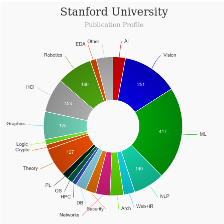

# Masters of Science in Engineering, Design Impact [read more](https://designimpact.stanford.edu/)
<iframe width="560" height="315" src="https://www.youtube.com/embed/4w2YnX5ibi0" title="YouTube video player" frameborder="0" allow="accelerometer; autoplay; clipboard-write; encrypted-media; gyroscope; picture-in-picture" allowfullscreen></iframe>

## About Masters of Science in Engineering, Design Impact - Stanford University
|   |   |
|---|---|
| Degree Offered |  **Master of Science** |
| Other Degrees Offered| **-**|
| Duration       | **2 years**                      |
| Location       | **Stanford, California**          |
| Total Credits  | **60**                           | 
| Program Offered| **FALL**|
|Deadline| **December 1**  |
|Offer Made| **Early April**Read [here](https://staging.thegradcafe.com/survey/index.php?q=Stanford+design+impact&t=a&o=)|
|Admission Type| **Regular Decision** |
|STEM| ✅ |
|Information Session Conducted| ✅ [click here to register](https://designimpact.stanford.edu/) |

---

## Entry Requirements for Masters of Science in Engineering, Design Impact - Stanford University
|   |   |
|---|---|
| GRE | ❌ |
| TOEFL**       | **100** (for non-native speakers)|
| Personal Statement       | ✅          |
|Personal Statement Word limit| **1200 words** |
| Letter of Recommendation  | **3**                           | 
|Resume / CV|✅|
|Transcripts|✅ (unofficial) |
|Portfolio|✅ (Read more [here](https://designimpact.stanford.edu/apply)) |
|Application Fee| **$125** |

**English proficiency can be shown in many ways, click [here](https://gradadmissions.stanford.edu/applying/starting-your-application/required-exams) for more information

### Personal Statement Prompt
There are many great graduate design programs in the US and in the world, each has its own special focus.  For your statement of purpose please write an essay of no more than 1200 words in response to this prompt: As Steve Jobs said, we are here to "make a little dent in the universe”. How do you hope to make that dent, and the world a better place? What do you expect to learn in this program that will make this possible? Please don’t repeat information we already have from your transcript and resume.  We are more interested in learning about your goals as a designer and why you think that Stanford’s program is your best fit.  Make this a forward-looking essay addressing your plans for Stanford and beyond

---

## Cost of Attendence at Masters of Science in Engineering, Design Impact - Stanford University
|   |   |
|---|---|
| Cost (per quarter) (in-state)      | **$12,540**          |
| Cost (per quarter) (out-of-state)      | **$12,540**      |
|Approx. Total Cost| **$75,240**|

---

## What's special aboutMasters of Science in Engineering, Design Impact - Stanford University?

### d.school connection [read more](https://dschool.stanford.edu/)
Attending any of the seven graduate schools at Stanford will make you eligible for classes at the d.school; simply apply for the individual d.school classes that most interest you. However, if you want to gain depth and expertise in design and make it the focus of your studies, projects, and community at Stanford, we welcome your application for the MS in Design Impact.

### Loft [read more](https://dloft.stanford.edu/)
The inspiration for d.loft STEM is the "Design for the Other 90% Movement,” which consists of engineers, designers, scientists, technologists, architects, and mathematicians engaged in designing low-cost innovative solutions for large portion of the world’s population who do not have access to basic services and products.

---

## Masters of Science in Engineering, Design Impact - Stanford University Course Ranking
|||
|---|---|---|
| Top 50 Best Value UX Design Graduate Programs  | **#4**  |valuecolleges.com | 
| Top UX School      | **#6**      | topuxschool.com|

---

## Faculty at Masters of Science in Engineering, Design Impact - Stanford University [read more](https://designimpact.stanford.edu/about) 
Faculty in the department of Design Impact, Stanford collaborate throughout the university and beyond on their research.

Visit [CSRankings](http://csrankings.org/#/index?all&us) for more stats 

---

## Research Areas at Masters of Science in Engineering, Design Impact - Stanford University
* Empathic Heathcare: Personalizing healthcare in the digital age
* ‍Empowering Power: Giving people control of their own resources

---

## Careers after Masters of Science in Engineering, Design Impact - Stanford University 
Based on the breadth of our program, students end up working in a very broad spectrum of jobs. Recent graduates ended up far and wide, from New Zealand to Silicon Valley. Typical paths include working at  Silicon Valley tech companies like Facebook, Google, and Apple, as well as joining or founding startups. Students also work for design consulting companies. Focus of work includes engineering, business, human factors, UX, and project management.

---

## Social Handles of the program

* 🐦  [Twitter ](https://twitter.com/stanforddschool?lang=en)  
* 💢  [Instagram ](https://www.instagram.com/stanforddschool/?hl=en) 
* 🌀  [d.school News](https://dschool.stanford.edu/news-events)

---

## Housing (off-campus & on-campus) links for Stanford University 
* [Stanford Student Housing](https://rde.stanford.edu/studenthousing)
* [Stanford University Housing, Sublets & Roommates](https://www.facebook.com/groups/1694899444070553/)
* [UStanford University Off-Campus Housing](https://www.facebook.com/groups/1831603267114508/)
