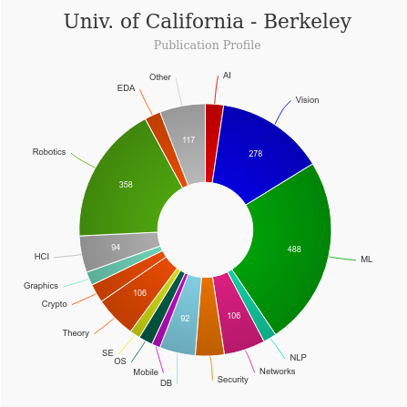

# Master of Information Management and Systems (MIMS) [🔗](https://www.ischool.berkeley.edu/programs/mims)
<iframe width="560" height="315" src="https://www.youtube.com/embed/vVrbEP4rsHI" title="YouTube video player" frameborder="0" allow="accelerometer; autoplay; clipboard-write; encrypted-media; gyroscope; picture-in-picture" allowfullscreen></iframe>

---
|   |   |
|---|---|
| Degree Offered |  **Master of Science** |
| Other Degrees Offered| **Ph.D., Certificate**|
| Duration       | **2 years**                      |
| Location       | **Berkeley, California**          |
| Total Credits  | **48**                           | 
| Program Offered| **FALL**|
|Deadline| **January 6**  |
|Offer Made| **See [here](https://www.thegradcafe.com/survey/index.php?q=University+Of+California%2C+Berkeley+mims&t=a&o=i&pp=250)**|
|Admission Type| **Regular Decision** |
|STEM| ✅ |
|Information Session Conducted| ✅ [click here to register](https://www.ischool.berkeley.edu/programs/mims/events) |

# Entry Requirements for Master of Information Management and Systems (MIMS) - UC Berkeley
---
|   |   |
|---|---|
| GRE | ❌ |
| TOEFL       | **90** (for non-native speakers)|
|IELTS| **7.0**|
| Personal Statement       | ✅          |
| Personal History Essay       | ✅          |
|Short Answer Essay|✅|
|Personal Statement Word limit| **1–2 pages** |
| Letter of Recommendation  | **3**                           | 
|Resume / CV|✅|
|Transcripts|✅ (unofficial) |
|Portfolio|❌ |
|Interview| ✅ (*Some of our MIMS applicants will be invited to interview as part of the application review process.*)|
|Application Fee| **$140** |

**English proficiency can be shown in many ways, click [here](https://admissions.berkeley.edu/requirements-international-students) for more information

## Personal Statement Prompt
The Statement of Purpose should describe your relevant academic and professional experience and accomplishments, your future professional goals once the degree is acquired, and why you are drawn to the MIMS program and believe it would be a good fit for you and your goals.

The focus should be on your preparation, experience, and aims rather than a discussion of the trends or the importance of information in general. The most successful statements are 1–2 pages in length and focus on the strengths, experiences, and fit of the applicant, providing the admissions committee with evidence and justification for admitting those applicants who are qualified and well-suited for the I School.

## Personal History Statement
n addition to describing how your personal background and experiences have influenced your decision to pursue graduate studies, you may also include any relevant information on the following topics:

* How you have overcome barriers to access higher education
* How you have come to understand the barriers faced by others
* Your academic service to advance equitable access to high education for women, racial minorities, and individuals from other groups that have been historically underrepresented in higher education
* Your research focusing on underserved populations or related issues of inequality
* Your leadership among such groups

The Personal History essay, typically `1-2 pages` in length, provides an opportunity for the admissions committee to get to know you better on a personal level, and content should not duplicate what has been shared in the Statement of Purpose. For additional guidance, please review the Graduate Division's [Personal Statement Guide](http://www.grad.berkeley.edu/admissions/personal_statement.shtml).

## Short Answer Essay
The Short Answer Essay should answer the following question in `300 words or less`. Please be sure this essay demonstrates your quantitative, analytical, and problem-solving abilities, as well as your strong writing skills.

> What is the most interesting information problem you have ever solved? Explain why it was interesting and how you solved it.

# Cost of Attendence at Master of Information Management and Systems (MIMS) - UC Berkeley
---
|   |   |
|---|---|
| Cost (per year) (in-state)      | **$28,385.50**          |
| Cost (per year) (out-of-state)      | **$40,630.50**      |
|Approx. Total Cost| **$56,771**(in-state)  **$81,261**(out-of-state)|
---

# What's special about Master of Information Management and Systems (MIMS) - UC Berkeley?

## MIMS Learning Paths [🔗](https://www.ischool.berkeley.edu/programs/mims/paths)
* Human-Computer Interaction and User Experience Design
* Applied Data Science and Machine Learning
* Information Policy and Ethical Technology
* Social and Technical Innovation in Entrepreneurship
* Cybersecurity
* Design
* Information privacy
* Information technology for development
* Algorithmic fairness
* Biosensing

## HCI Research [🔗](https://hci.berkeley.edu/)
UC Berkeley has top class HCI Research Faculties.

## Berkeley Institute of Design [🔗](http://bid.berkeley.edu/)
The Berkeley Institute of Design (BiD) is a research group that fosters a deeply interdisciplinary approach to design for the 21st century, spanning human-computer interaction, mechanical design, education, architecture and art practice.

## Hybrid Ecologies Lab [🔗](http://www.hybrid-ecologies.org/)
The Hybrid Ecologies Lab (H•E•L) explores scientific research, design, and art through the innovation, development, deployment, and evaluation of novel physical devices and interactive systems that advance our computing culture, encourage broad participation by non-experts within science and engineering, improve human health and well-being, and provoke critical debate and inquiry concerning our existing and emerging technological society.

## Berkeley Center for New Media [🔗](http://bcnm.berkeley.edu/)
The Berkeley Center for New Media is a research, teaching, and public events program at UC Berkeley.

## The Center for Information Technology Research in the Interest of Society (CITRIS) [🔗](https://citris-uc.org/)
CITRIS and the Banatao Institute is a University of California research center focused on creating IT solutions that generate social and economic benefits for everyone.

# Master of Master of Information Management and Systems (MIMS) - UC Berkeley Course Ranking
---
|||
|---|---|---|
| Top 50 Best Value UX Design Graduate Programs  | **#7**  |valuecolleges.com | 
| Top UX School      | **#11**      | topuxschool.com|
|Top UX Graduate Degree Programs| **#1**| usertesting.com|
---

# Faculty at Master of Information Management and Systems (MIMS) - UC Berkeley [🔗](https://www.ischool.berkeley.edu/people?role=122&faculty_type=72) 
Faculty in the department of Information at the UC Berkeley in California collaborate throughout the university and beyond on their research.

*Visit [CSRankings](http://csrankings.org/#/index?all&us) for more stats*

---
# Research Areas at Master of Information Management and Systems (MIMS) - UC Berkeley [🔗](https://www.ischool.berkeley.edu/research/areas)
* Computer-mediated Communication[🔗](https://www.ischool.berkeley.edu/research/cmc)
* Design [🔗](https://www.ischool.berkeley.edu/research/design)
* Entrepreneurship [🔗](https://www.ischool.berkeley.edu/research/entrepreneurship)
* Human Computer Interaction [🔗](https://www.ischool.berkeley.edu/research/hci)
* Information Economics [🔗](https://www.ischool.berkeley.edu/research/infoecon)
* Information Organization [🔗](https://www.ischool.berkeley.edu/research/infoorganization)
* Information Policy [🔗](https://www.ischool.berkeley.edu/research/infopolicy)
* Information Retrieval & Search [🔗](https://www.ischool.berkeley.edu/research/search)
infoorganization)
* Information Visualization [🔗](https://www.ischool.berkeley.edu/research/infoviz)
* Social & Cultural Studies [🔗](https://www.ischool.berkeley.edu/research/social)

# Careers after Master of Information Management and Systems (MIMS) - UC Berkeley [🔗](https://www.ischool.berkeley.edu/programs/mims/careers)
MIMS graduates can be found in a wide range of jobs and industries at the intersection of technology, people, and information.
[Career Report 2018](https://www.ischool.berkeley.edu/sites/default/files/mims_career_report_2018.pdf)

## Job Titles
* Business Analyst
* Data Scientist
* Enterprise Architect
* Machine Learning Engineer
* Principal Consultant
* Product Manager
* Security Engineer
* Software Engineer
* Technical Program Manager
* UX Designer
* UX Researcher

## Salary Range
**$132,500** Median Salary

---
# Social Handles of the program

* 🐦  [Twitter ](https://twitter.com/BerkeleyISchool)  
* 💢  [Instagram ](https://www.instagram.com/berkeleyischool/?hl=en) 
* 🛑  [Youtube](https://www.youtube.com/BerkeleyISchool)
* 🌀  [Berkeley iSchool News](https://www.ischool.berkeley.edu/news)

---

# Housing (off-campus & on-campus) links for UC Berkeley
* [UC Student Housing](https://housing.berkeley.edu/)
* [UC Berkeley Off-Campus Housing](https://www.facebook.com/groups/ucberkeleyoffcampushousing/)
* [UC Berkeley Off-Campus Housing](https://www.facebook.com/groups/ucberkeleyoffcampushousing/)
