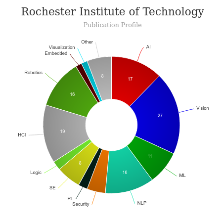

# Entry Requirements for Master of Human Computer Interaction (HCI) - Rochester Institute of Technology
|   |   |
|---|---|
| GRE | ✅ (for international students)  |
| TOEFL**      | **88** (for non-native speakers)|
|IELTS| **6.5** |
| Personal Statement       | ✅   (Read [here](https://www.rit.edu/admissions/graduate/application-instructions#application-instructions-and-requirements))       |
|Personal Statement Word limit| **-** |
| Letter of Recommendation  | **2**                           | 
|Resume / CV|✅|
|Transcripts|✅ (unofficial) |
|Portfolio|❌ |
|Application Fee| **$65** |

**English proficiency can be shown in many ways, click [here](https://www.rit.edu/admissions/graduate/application-instructions#application-instructions-and-requirements) for more information

## Personal Statement Prompt
Please upload a personal statement describing your educational objectives. You may wish to
address: 

* Why you are applying for the program?
* How your degree program will relate to your long-range career objectives?
* What personal or “non-academic” qualities you will contribute to the learning environment in your program? 
* What prior experience you have with respect to your chosen program?
* Specifically why you want to attend RIT?

---

# Cost of Attendence at Master of Human Computer Interaction (HCI) - Rochester Institute of Technology
|   |   |
|---|---|
| Cost (per Credit) (in-state)      | **$2,171**          |
| Cost (per Credit) (out-of-state)      | **$2,171**      |
|Approx. Total Cost| **$91,170**|

---

# What's special about Master of Human Computer Interaction (HCI) - Rochester Institute of Technology

## Co-op [🔗](https://www.rit.edu/cooperative-education)
There’s a classic conundrum that recent college graduates have to untangle: Employers want candidates who have work experience. But how do you get experience without a job?
That’s easy. Get a co-op.

## Center for Accessibility and Inclusion Research [🔗](cair.rit.edu)
The Center for Accessibility and Inclusion Research (CAIR) brings together faculty and students who conduct and publish research at leading computing and education venues on accessibility and assistive technology for diverse users, including people who are deaf or hard of hearing, people who are blind, people with communication impairments, and older adults.

## Center for Human-aware AI (CHAI) [🔗](https://www.rit.edu/chai/)
To improve the quality of human life with breakthrough research in AI and to comprehensively equip future AI practitioners and scientists.

## HCI Research [🔗](http://hci-research.rit.edu/)
Faculty and students at RIT are conducting research in several areas of human computer interaction, including accessibility and inclusion, eye-tracking and visual perception, human-aware artificial intelligence, wearable and mobile computing, educational technology, consumer behavior, and usable security. This website is a hub for information across RIT. 

## Linguistic and Assistive Technologies Laboratory [🔗](http://latlab.ist.rit.edu/)
We conduct research in computational linguistics and human-computer interaction, with a primary focus on accessibility applications and assistive technology for people with disabilities. 

## Effective Access Technology [🔗](https://www.rit.edu/accessability/)
The mission of AccessAbility @ RIT is pursuing research and development that enhances accessibility and empowering individuals with varying abilities.

## HCI Research [🔗](http://hci-research.rit.edu/)
Faculty and students at RIT are conducting research in several areas of human computer interaction, including accessibility and inclusion, eye-tracking and visual perception, human-aware artificial intelligence, wearable and mobile computing, educational technology, consumer behavior, and usable security. This website is a hub for information across RIT.

## Project Option 
A capstone project is a large body of work, which you undertake independently under the supervision of a full-time IST faculty member. A Project consists of a nontrivial design project, software or web development project, and/or software or web deployment project and a detailed report discussing it; a capstone project may also consist of a research project that investigates more theoretical questions – along with a report that describes the research and results.  For the Project option, original insight into a problem is desirable but not required.  The project report is expected to be in the form of a scientific paper:  

• describing background and relevant results in the area  
• detailing the work carried out  
• discussing the significance of the deliverables of the endeavor and providing appropriate reference citations 

## Thesis Option 
As compared to a Project, a Thesis deals with a research question and involves a master’s level of original insight. The expectations for background research and justification are much higher for a Thesis, as compared to a Project.  It is expected that the quality of research produced in a Thesis would be suitable for submission as a research paper to a conference, a journal, or other form of public dissemination, and in general, students who are pursuing a Thesis option are expected to submit their research to such venues.  More specifically, the difference between a project and thesis is the nature of the work involved.

---

# Aid & Scholorship
RIT does not offer full cost or full tuition scholarships. The typical maximum scholarship amount is $20,000 per year. In addition, international students are eligible to work on campus up to 20 hours per week.

Graduate Applicants: We will automatically consider all graduate applicants for available merit-based tuition scholarships and assistantships. Scholarship and assistantship awards are made by the academic department at the time you apply for admission, are based on academic excellence, and vary by student and department. To be considered, complete the graduate application for admission.

---

# Master of Human Computer Interaction (HCI) - Rochester Institute of Technology Course Ranking
|||
|---|---|---|
| Top 50 Best Value UX Design Graduate Programs  | **#13**  |valuecolleges.com | 
| Top UX School      | **#23**      | topuxschool.com|

---

# Faculty at Master of Human Computer Interaction (HCI) - Rochester Institute of Technology[🔗](https://www.rit.edu/computing/school-of-information#faculty-staff) 
Faculty in the department of Information at RIT collaborate throughout the university and beyond on their research.

Visit [CSRankings](http://csrankings.org/#/index?all&us) for more stats 

---
# Research Areas at Master of Human Computer Interaction (HCI) - Rochester Institute of Technology
* Human-AI Collaboration for Identifying UX Problems (AI-Assisted UX Analysis)
* Aging and Accessibility
* Mobile, Wearable, and Ubiquitous Sensing & Interaction Techniques
* Human-computer interaction
* Accessibility
* Computing education: Ethical inclusion of students with disabilities
* Applications addressing needs of diverse populations, with emphasis on language, cognition, and healthcare
* Effective Access Technology
* Healthcare Technology

---

# Careers after Master of Human Computer Interaction (HCI) - Rochester Institute of Technology [🔗](https://www.rit.edu/careerservices/study/human-computer-interaction-ms)
In the human-computer interaction master's degree, you'll study how people interact with websites, computer systems, and software, enabling you to create intuitive interfaces that improve how we interact with and use emerging technologies.

## Job Titles
Entrepreneur, Frontend Developer & UX Designer, Mobile Applications Designer, Product Designer, Research Associate, Senior Software Engineer, UI/UX Designer, UX/UI Developer, User Experience Researcher

## Salary Range
**$80K** - Median First-Year Salary of RIT Graduates 

---

# Social Handles of the program

* 🐦  [Twitter ](twitter.com/RITtigers)  
* 🌀  [HCI News](https://www.rit.edu/study/human-computer-interaction-ms)

---

# Housing (off-campus & on-campus) links for Rochester Institute of Technology
* [RIT Off Campus Housing](https://www.rit.edu/studentaffairs/iss/life-rit/campus-housing)
* [RIT Housing](https://www.facebook.com/rithousing/)
* [Rochester Institute of Technology (RIT) Housing, Sublets & Roommates](https://www.facebook.com/groups/554638331345485/)
* [RIT Off-Campus and Commuter Services](https://www.facebook.com/CommutersatRIT/)
