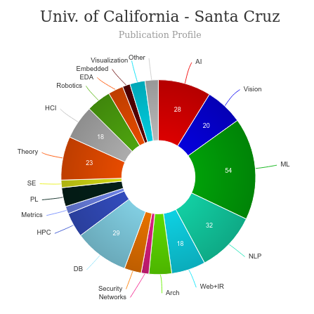

# Master of Human Computer Interaction (HCI) [🔗](https://grad.soe.ucsc.edu/hci/)
<iframe width="560" height="315" src="https://www.youtube.com/embed/iZBFz4BqiuY" title="YouTube video player" frameborder="0" allow="accelerometer; autoplay; clipboard-write; encrypted-media; gyroscope; picture-in-picture" allowfullscreen></iframe>

## About Master of Human Computer Interaction (HCI) - University of California, Santa Cruz
|   |   |
|---|---|
| Degree Offered |  **Master of Science** |
| Duration       | **15 month (with optional internship)**                       |
| Location       | **Santa Cruz, California**          |
| Total Credits  | **53**                           | 
| Program Offered| **FALL**|
|Deadline| **March 31**|
|Admission Type| **Regular Decision** |
|STEM| ✅ |
|Information Session Conducted| ❌ [click here to book an appointement with advisor](https://grad.soe.ucsc.edu/contacts) |

---

## Entry Requirements for Master of Human Computer Interaction (HCI) - University of California, Santa Cruz
|   |   |
|---|---|
| GRE | ❌ |
| TOEFL**       | **100** (for non-native speakers)|
| Personal Statement       | ✅          |
|IELTS| **7.5** | 
|Personal Statement Word limit| **-** |
| Letter of Recommendation  | **3**                           | 
|Resume / CV|✅|
|Transcripts|✅ (unofficial) |
|Portfolio|❌ |
|Application Fee| **$140** |
|Personal History Statement| ✅| 

**Admission Requirement can be fulfilled in many ways, click [here](https://www.gradadmissions.ucsc.edu/international-applicants) for more information

### Statement of Purpose Prompt
The Statement of Purpose should be a concise, well-written essay about your background and your reasons for pursuing graduate study in the field you have chosen. The requirements for your Statement of Purpose may vary depending on the program you are applying to, so be sure to read the program's application requirements page: go to Graduate Programs; scroll down and click on the name of the program; application requirements will open in a new window.

### Personal History Statement Prompt
The Personal History Statement is required of all applicants.This statement will be used in conjunction with your application for graduate admission and financial support. Please note that the Personal History Statement should not duplicate the Statement of Purpose. As with the Statement of Purpose, the requirements may vary depending on the program you are applying to. Read the program's application requirements page: go to Graduate Programs; scroll down and click on the name of the program; application requirements will open in a new window.

Read [here](https://www.gradadmissions.ucsc.edu/instructions) the complete admission guide

---

## Cost of Attendence at Master of Human Computer Interaction (HCI) - University of California, Santa Cruz

*Read more about the cost [here](https://registrar.ucsc.edu/fees/registration/undergraduate-student-fees.html#graduate)*  *Please double-check with the program advisor*

---

## Financial Support 
Read [here](https://grad.soe.ucsc.edu/financial-support)

---

## What's special about Master of Human Computer Interaction (HCI) - University of California, Santa Cruz?

### Silicon Valley Campus [🔗](https://siliconvalley.ucsc.edu/)
Located in the heart of Silicon Valley, the UCSC Human Computer Interaction Master's program offers unprecedented access to HCI industry companies and events.

### Center for Computational Experience  [🔗](https://cce.ucsc.edu/)
We innovate technology practices and platforms to enhance everyday, lived human experience. Founded in 2010 with a focus on games and playable media, the Center's mission has grown to encompass a broad range of computationally enabled activities--from VR stroke rehabilitation, to apps that help users track and manage mood, to wearables that assist conversational balance, as well as cutting edge games and playful experiences. Our world-class research faculty combine expertise in engineering, arts, humanities, and design. We draw upon the unique strengths and sensibilities of UC Santa Cruz--a deep concern for wellbeing and social good, closeness to and respect for the natural world, and technological skill (with Silicon Valley less than an hour away). Choose one of our research themes below, to learn more about what we do. 

### Tech4Good Lab [🔗](https://tech4good.soe.ucsc.edu/#/)
We do research in social computing, exploring the intersection of computational systems and social interaction. Our mission is to develop systems--integrating design, modeling, and algorithms--to support flourishing in work, education, governance, and community engagement. 

### Assist Lab [🔗](https://assist.soe.ucsc.edu/)
Assistive Sociotechnical Solutions for Individuals with Special needs using Technology 

### ALT Games Lab [🔗](https://altgameslab.soe.ucsc.edu/)
The Alternative Learning Technologies and Games (ALT Games) Lab is an interdisciplinary team with projects ranging across multiple domains such as Human-Computer Interaction, Learning Science, Electrical Engineering, Psychology, and Digital Arts. The mission of the lab is to create and explore the potential of alternative controllers, novel interfaces, and other forms of unique input/output.

---

## Master of Master of Human Computer Interaction (HCI) - University of California, Santa Cruz Course Ranking
The program was introduced this year

---

## Faculty at Master of Human Computer Interaction (HCI) - University of California, Santa Cruz [🔗](https://grad.soe.ucsc.edu/hci/faculty) 
Faculty in the department of Human Computer Interaction at the California, Santa Cruz collaborate throughout the university and beyond on their research.

Visit [CSRankings](http://csrankings.org/#/index?all&us) for more stats 

---
## Research Areas at Master of Master of Human Computer Interaction (HCI) - University of California, Santa Cruz
* Information visualization
* computer graphics
* VR/AR
* HCI
* applied machine learning
* new media arts
* creative coding
* games and emotion 
* social and embodied interaction
* interactive characters
* game user research 
* wellbeing and technology
* human factors and ergonomics
* accessibility
* assistive technology
* usability
* empirical studies 
* human-centered design
* Human Robot Interaction

---

### Student Handbook
View [here](https://grad.soe.ucsc.edu/hci/handbook)

---

## Careers after Master of Human Computer Interaction (HCI) - University of California, Santa Cruz [🔗](https://grad.soe.ucsc.edu/hci/jobs)
An M.S. in Human Computer Interaction from UCSC provides students with tangible skills and a portfolio necessary to pursue a career in human computer interaction, user experience (UX) design, user interface (UI) design, and more.

### Job Titles
* Front-End Designer/Developer
* Human Factors Engineer
* Interaction Designer
* Product Manager & Designer
* User Experience Researcher/Designer

---
## Social Handles of the program

* 🐦  [Twitter ](https://twitter.com/ucsc)  
* 💢  [Instagram ](https://www.instagram.com/ucsc/?hl=en) 
* 🛑  [Youtube](https://www.youtube.com/channel/UCWOt6UqtvLP33EeIax7zHKw)
* 🌀  [HCI News](https://hci.ucsc.edu/)

---

## Housing (off-campus & on-campus) links for University of California, Santa Cruz
* [UCSC Student Housing](https://housing.ucsc.edu/)
* [University of California, Santa Cruz (UCSC) Housing, Sublets & Roommates](https://www.facebook.com/groups/1450196305292286/)
* [Santa Cruz Housing](https://www.facebook.com/groups/1454999854729837//)
* [UC Santa Cruz Off-Campus Housing](https://www.facebook.com/groups/284404462009464/)
