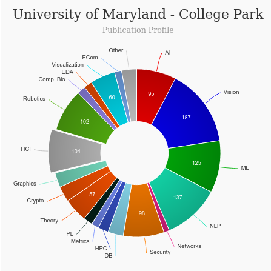

# Master of Human Computer Interaction (HCIM) [🔗](https://ischool.umd.edu/)
<iframe width="560" height="315" src="https://www.youtube.com/embed/UPXV6sHERdU" title="YouTube video player" frameborder="0" allow="accelerometer; autoplay; clipboard-write; encrypted-media; gyroscope; picture-in-picture" allowfullscreen></iframe>

## About Master of Master of Human Computer Interaction (HCIM) - University of Maryland

|   |   |
|---|---|
| Degree Offered |  **Master of Science** |
| Other Degrees Offered| **Bachelor of Science, Certificate, PHD**|
| Duration       | **2 years**                      |
| Location       | **College Park, MD**          |
| Total Credits  | **30**                           | 
| Program Offered| **FALL**|
|Deadline| **January 15**  |
|Offer Made| **Read [here](https://www.thegradcafe.com/survey/index.php?q=university+of+maryland&t=a&o=p&pp=50)**|
|Admission Type| **Regular Decision** |
|STEM| ✅ |
|Information Session Conducted| ✅ [click here to register](https://ischool.umd.edu/academics/virtual-info-sessions) |

---

## Entry Requirements for Master of Master of Human Computer Interaction (HCIM) - University of Maryland
|   |   |
|---|---|
| GRE | ✅ (international applicants only) |
| TOEFL**       | **100** (for non-native speakers)|
| Personal Statement       | ✅          |
|Personal Statement Word limit| **1000 ‐2000 word** |
| Letter of Recommendation  | **3**                           | 
|Resume / CV|✅|
|Transcripts|✅ (unofficial) |
|Portfolio| ✅ Get more information [here](https://gradschool.umd.edu/sites/gradschool.umd.edu/files/uploads/admissionsforms/umdsupplementaryapplicationhcim1.pdf) |
|Application Fee| **$75** |

**English proficiency can be shown in many ways, click [here](https://gradschool.umd.edu/admissions/english-language-proficiency-requirements) for more information

### Personal Statement Prompt [🔗](https://app.applyyourself.com/_fileroot/clnt-1072/umdstatementofpurpose.pdf)
* What are your reasons for undertaking graduate study at the University of Maryland, College Park? Indicate, if appropriate any specific areas of research
interest. You may wish to discuss past work in your intended field or allied fields, your plans for a professional career, or how you developed your interest
in or knowledge of your chosen subject.

* What life experiences have prepared you to pursue a graduate degree at a large and diverse institution such as the University of Maryland? Among the
items you might care to include would be your financial, community and family background, or whether you are the first person in your family to pursue
higher education or any other factors that you believe would contribute to the diversity of our academic community. You may also wish to give the
graduate admissions committee some examples of your determination to purse your goals, your initiative and ability to develop ideas, and/or your
capacity for working through problems independently.

---

## Student Handbook
Get it [here](https://ischool.umd.edu/academics/handbooks-policies-graduate)

---

## Cost of Attendence for Master of Master of Human Computer Interaction (HCIM) - University of Maryland [🔗](https://ischool.umd.edu/academics/tuition-fees-graduate)
|   |   |
|---|---|
| Cost (per Credit) (in-state)      | **$871.83**          |
| Cost (per Credit) (out-of-state)      | **$1765.83**      |
|Approx. Total Cost| **$26,300.1 (in-state) & $53,120 (out-of-state)**|

---

## What's special about Master of Master of Human Computer Interaction (HCIM) - University of Maryland

### The Human-Computer Interaction Lab (HCIL) [🔗](https://ischool.umd.edu/research/centers-and-labs/hcil)
The Human-Computer Interaction Lab has a long, rich history of transforming the experience people have with new technologies. From understanding user needs to developing and evaluating those technologies, the lab’s faculty, staff, and students have been leading the way in HCI research and teaching.

### Center for Advanced Study of Communities and Information (CASCI) [🔗](https://ischool.umd.edu/research/centers-and-labs/casci)
The Center for the Advanced Study of Communities and Information (CASCI) is a multidisciplinary research network, based at the University of Maryland. CASCI exists to facilitate research and education that advances our understanding of the technology, information, and organization approaches needed to realize the potential of 21st century communities to support learning, facilitate innovation, transform science and scholarship, promote economic development, and enhance individual and civic well-being.

### Trace Research & Development Center [🔗](https://ischool.umd.edu/research/centers-and-labs/trace)
Our mission is to capitalize on the potential that technologies hold for people experiencing barriers due to disability, aging, or digital literacy, and to prevent emerging technologies from creating new barriers for these individuals. In doing this, we bring together disciplines such as information science, computer science, engineering, disability studies, law, and public policy. We engage in research, development, tech transfer, education, policy, and advocacy. 

### Interest Groups [🔗](https://ischool.umd.edu/interest-groups)
UMD iSchool Interest Groups & Lecture Series

### iConsultancy Experiential Learning Program [🔗](https://ischool.umd.edu/iconsultancy)
To design and execute technology-based experiential learning projects.  From analytics to database design to user experience, we tackle these information challenges with our talented students and expert faculty to provide real-world experiences and a product you can use.

### UXTerps [🔗](https://www.linkedin.com/company/uxterps/)
UXTerps aims to help students develop and strengthen the required skills to become competent UX practitioners! With the support of our advisors, UXTerps brings together a diverse design community comprised of University of Maryland students from all backgrounds and courses of study who share a passion for user experience (UX). Our mission is to support the out-of-class learning of user experience design and research and to provide peer mentorship to any students interested in UX-related fields. UXTerps is a space for students to share ideas, present projects, and learn from one another through student-led workshops.

---

## Master of Master of Human Computer Interaction (HCIM) - University of Maryland Course Ranking
|||
|---|---|---|
| Top 50 Best Value UX Design Graduate Programs  | **#20**  |valuecolleges.com | 
| Top UX School      | **#21**      | topuxschool.com|

---

## Faculty at Master of Master of Human Computer Interaction (HCIM) - University of Maryland [🔗](https://ischool.umd.edu/about/directory) 
Faculty in the department of Human Computer Interaction at the University of Maryland in College Park collaborate throughout the university and beyond on their research.

Visit [CSRankings](http://csrankings.org/#/index?all&us) for more stats 

---

## Research Areas at Master of Master of Human Computer Interaction (HCIM) - University of Maryland [🔗](https://hcil.umd.edu/research-areas/)
* Accessibility
* Children as Design Partners
* Computational Journalism
* Open Data & Citizen Science
* STEM Learning through Alternate Reality Games
* Tech to Engage Communities
* User Privacy
* Visual Browser Interface
* Visualization
* Wearable Technology
* Dynamics of Online Communities
* Social Network Analysis
* Citizen Science
* User Participation in Sharing Geographic or Local Information
* Technology's Impact on Communities

---

## Careers after Master of Master of Human Computer Interaction (HCIM) - University of Maryland [🔗](https://ischool.umd.edu/academics/master-of-science-in-human-computer-interaction/faq)
Graduates from the University of Maryland's department of Human Computer Interaction find careers as designers and researchers who improve people's interactions with technology and the world around them.

### Companies
ome fantastic partners already providing internships and opportunities to our students (and receiving great support in return!) are Ernst & Young, Capital One, Accenture, PriceWaterHouseCoopers, IBM, Google, Microsoft, Deloitte, Library of Congress, National Archives, National Geographic, NASA Goddard Space Flight Center, Smithsonian Institution, and the US Department of Justice. To discuss the best way to provide an internship for UMD iSchool students, please contact Dr. Katy Lawley, Lecturer & Career Services Lead.

### Job Titles
* User Experience Designer
* Interaction Designer
* User Researcher
* User Experience Researcher
* Information Architect
* Visual Designer
* User Interface Designer
* Usability Analyst 
* Product Designer

---

## Social Handles of the program

* 🐦  [Twitter ](https://twitter.com/iSchoolUMD)  
* 💢  [Instagram ](https://www.instagram.com/ischoolumd/?hl=en) 
* 🛑  [Youtube](https://www.youtube.com/user/ischoolumd)
* 🌀  [HCDE News](https://medium.com/hcil-at-umd)

---

## Housing (off-campus & on-campus) links for University of Maryland
* [UMD Student Housing](http://reslife.umd.edu/)
* [Housing, Sublets & Roommates in College Park, Maryland](https://www.facebook.com/groups/1585931414992006/)
* [University of Maryland Department of Resident Life](https://www.facebook.com/UMDreslife/)
