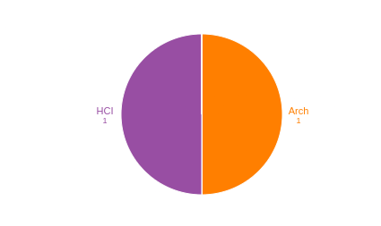

# UI/UX Cohort | 10kdesigners [🔗](https://www.smu.edu/Lyle/Academics/Multidisciplinary-Programs/MADI)
<iframe width="560" height="315" src="https://www.youtube.com/embed/u-IxgGCQbsw" frameborder="0" allow="accelerometer; autoplay; clipboard-write; encrypted-media; gyroscope; picture-in-picture" allowfullscreen></iframe>

## About  M.A in Design & Innovation - Southern Methodist University (SMU)

|   |   |
|---|---|
| Degree Offered |  **Master of Arts** |
| Other Degrees Offered| **-**|
| Duration       | **2 years**                      |
| Location       | **University Park, Texas**          |
| Total Credits  | **30**                           | 
| Program Offered| **FALL**|
|Deadline| **July 15**  |
|Offer Made| **-**|
|Admission Type| **Regular Decision** |
|STEM| ❌ |
|Information Session Conducted| ✅ [click here to register](https://www.smu.edu/Lyle/Academics/Multidisciplinary-Programs/MADI/Apply) |

---

## Entry Requirements for  M.A in Design & Innovation - Southern Methodist University (SMU)

|   |   |
|---|---|
| GRE | ❌ |
| TOEFL**       | **80** (for non-native speakers)|
| Personal Statement       | ✅          |
|Personal Statement Word limit| **1200 words** |
| Letter of Recommendation  | **2**                           | 
|Resume / CV|✅|
|Transcripts|✅ (unofficial) |
|Portfolio|❌ |
|Application Fee| **$75** |

**English proficiency can be shown in many ways, click [here](https://www.smu.edu/Lyle/Apply-Now/Graduate-Admissions/Apply/Graduate-Application-Instructions/International-Application-Requirements-and-Instructions) for more information

### Personal Statement Prompt
* Your point of view about Human-Centered Design and why you need MADI to take you to the next level. 
* What is missing in your life that you think MADI will be able to provide.
* What change you’d like to affect through learning and mastering the design process. 

---

## Cost of Attendence at M.A in Design & Innovation - Southern Methodist University (SMU)

|   |   |
|---|---|
| Cost (per 3 hour course) (in-state)      | **$4,350**          |
| Cost (per 3 hour course) (out-of-state)      | **$4,350**      |
|Approx. Total Cost| **$43,500**|

---

## What's special about M.A in Design & Innovation - Southern Methodist University (SMU)
## Designer-in-Residence Program [🔗](https://www.smu.edu/Lyle/Academics/Multidisciplinary-Programs/MADI/Partnerships/Designer-in-Residence-Program)
The Designer-in-Residence program exists to enrich the MADI student experience by engaging with design professionals to bring the most up-to-date working knowledge to the curriculum. We partner with a designer that has skill sets aligned with our studio project each semester, where they come in for critique, guidance, and support. The program emphasizes direct contact with MADI students to broaden student exposure across multiple design disciplines. The Designers-in-Residence have spent approximately 2,400 hours over the last 5 years with our graduate students. We also highlight who they are and what their perspective is on design with a public event each semester.

## SMU Design Council [🔗](https://www.smu.edu/Lyle/Academics/Multidisciplinary-Programs/MADI/Partnerships/SMU-Design-Council)
The SMU Design Council is a forum for leaders who appreciate and acknowledge Human-Centered Design and Innovation as critical strategic elements of their future success. The Design Council along with the Master of Arts in Design and Innovation (MADI) and the Designer-in-Residence, come together to make up the Design and Innovation Programs at SMU.

## MADI Events [🔗](https://blog.smu.edu/madievents/)
Every year we work with our partners to put on timely, thought-provoking, and engaging events as a way to bring together the DFW design community.

### Orientation 
MADI Orientation is one of our most exciting times and dedicated to setting the stage and expectation of what each student’s graduate experience will be like. We welcome new students to the program by going through all aspects of the program with plenty of getting-to-know-you time! We then get to welcome back returning students so the whole MADI family has the opportunity to connect before classes start. Orientation is also when we reveal our new MADI T-shirts, common read, and Coffee Partners. 

### Coffee Partners
We recognize that not everyone has a class together, and we wanted to create a way to help build
connections across all of MADI, for new and returning students alike. Through our student Coffee
Partners, new students are partnered with existing students and graduating students are partnered with alumni. This has been a great method for connecting students who might not otherwise have a chance to get to know each other and also for keeping alumni engaged in the program.

### Field Trips 
We are always looking for ways to open our academic doors to the professional industry and to get our
students through professional doors in return. One way we create these connections is through field trips to different design firms. These mostly happen within our Context & Impact course, but we love making new and interesting connections whenver possible. Community is a huge part of MADI, and field trips are a way we are able to expand and deepen ours. 

### End-of-Semester Reviews
MADI is a transformational program not only with the work our students create but also on a personal
level. We want to honor the different ways students grow and embody the Human-Centered Design
process by having each student give an End-of-Semester Review. This is a chance students have to reflect and present on who they were at the beginning of the semester and who they are at the end. In turn, hearing each student’s personal reflection about their time in MADI becomes transformational for the faculty and staff who are at the presentations. This experience helps build presentation skills and also creates a much-deserved space for reflection and application.

Read more [here](https://www.smu.edu/-/media/Site/_Lyle/Academics/Multidisciplinary/MADI/MADI_MADIBook2021.pdf) from MADI Book 2021

---

## Faculty at  M.A in Design & Innovation - Southern Methodist University (SMU) [🔗](https://www.smu.edu/Lyle/Academics/Multidisciplinary-Programs/MADI/People) 
Faculty in the department of Lyle School of Engineering at the Southern Methodist University  collaborate throughout the university and beyond on their research.

Visit [CSRankings](http://csrankings.org/#/index?all&us) for more stats 

---

## Research Areas at M.A in Design & Innovation - Southern Methodist University (SMU) [🔗](https://catalog.smu.edu/preview_program.php?catoid=57&poid=15033)
* The Context and Impact of Design
* Form and Composition
* Human-Centered Design
* Design and Innovation Studio
* Applied Anthropology
* Political Economy: Global Processes and Problems
* Starting a Business
* Early-Stage Valuation and Fund
* User Interface Design
* Innovation and Design Attitude
* Design Research Strategies
* Innovation Management

---

## Careers after  M.A in Design & Innovation - Southern Methodist University (SMU) [🔗](https://blog.smu.edu/madi/)
We strive to be an academic program with open doors to professional practice and a space where our professional partners are fully welcome in our academic spaces. Students work on real-life projects from the beginning of the program as well as opportunities for other projects as they become available.

Student positions are typically posted on the Handshake Job Board. [Read more about student jobs at SMU](https://www.smu.edu/EnrollmentServices/financialaid/TypesOfAid/StudentEmployment/WherecanIfindajob).

---
## Social Handles of the program

* 🐦  [Twitter ](https://twitter.com/smu_madi)  
* 💢  [Instagram ](https://www.instagram.com/smumadi/?hl=en) 
* 🛑  [Youtube](https://www.youtube.com/channel/UCb3I06xyMRagb3u5U-aYWJQ)
* 🌀  [SMU MADI News](https://www.linkedin.com/school/smu-madi/)
